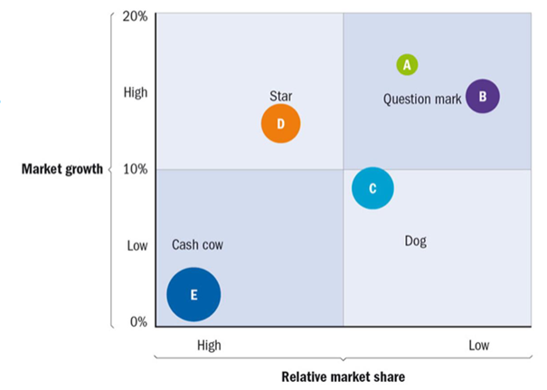

# Primary Activities / Processes:

Schritte:
- Incoming logistics
- Operations
- Internal and outbound logistics
- Marketing and Sales
- Service
Incoming Logistics: sorgt dafür, dass ungenutzte Ressourcen, halbfertige Produkte, Ressourcen für die Produktion und Personal zur richtigen Zeit am richtigen Ort sind

Operations: Produktion des Produktes

Internal and outbound logistics: 
- Internal: Ressourcen kommen ins Lager, werden dort kontrolliert und gelagert 
- Outbound: fertige Produkte kommen zurück ins Lager, werden kontrolliert, vielleicht für kurze Zeit gelagert und dann zum Kunden / zur Verkaufsstelle per 

LKW weiter transportiert

Marketing and Sales:
- Marketing: Werbung für das Produkt
- Sales: letzten Endes der Verkauf des Produktes

Service: Service, der nach dem Verkauf des Produktes ansteht (Reparation, Kundendienst, …)

Five P: Production, Place, Price, Promotion, Personnel

# Support Activities / Processes:

Aktionen, die nicht direkt mit der Produktion zu tun haben, werden „Support Activities“ genannt:

Human Ressource Management (HRM) ist Personal Management. Menschen in Business sind keine Kosten, aber Quellen, um Einnahmen zu erzielen.

HRM: Aufpassen auf: Einnahmen, Karriereplanung, Ausgaben, Belohnungen, Funktionsstruktur, Personalplanung, Personalverwaltung, Kommunikation und Öffentlichkeitsarbeit

Research and Development (R&D) designt und entwickelt Innovationen

Kommunikation:
- Legt interne und externe Kommunikation fest
- Gibt Kommunikationsratschläge und -hilfe
- Bereitet interne und externe Veröffentlichungen vor
- Hält Kontakt mit der Presse
- Beantworten Fragen aus der Öffentlichkeit
- Übersetzt
Finanzen stellt sicher, dass die Firma genügend Kapital hat

Information- and Communication technology (ICT): Übermittlung der Kommunikation, Speichern von Daten, Computer-Berechnungen

Legal ist da, da Firma auch rechtliche und juristische Kenntnisse braucht

Facilities sind Einrichtungen für Mitarbeiter, damit sich diese wohl fühlen (Sicherheit, Hygiene, Wartung, Inspektion, betriebsbereit)

# Exploring the Business Environment:

SWOT (Strengths, Weaknesses, Opportunities, Threats) Analyse für Stärke, Schwächen, Möglichkeiten und Bedrohungen der Firma

SWOT Threats / Opportunities step analysis:  

Competition: Monopol (Verkäufer 1, Käufer viele), Oligopol (Verkäufer wenige, Käufer viele), Polypol (Verkäufer viele, Käufer viele)

Porter’s five forces model:

Marktverschiebung:

# Strategic Management

Verschiedene Strategien, um am Markt teilnehmen zu können.

1. Where do we compete?

2. What unique value do we bring?

3. What resources and capabilities do we utilize?

4. How do we sustain our value?

BCG Matrix:

 
 
Forms of cooperation:
 
 

# Planning and control of business processes:

Die Anpassungen, wenn ein bestimmtes Ziel nicht erreicht werden kann, fallen unter dem Begriff „Planning and control“.

Planning and control:
- Fehler reduzieren und vermeiden
- Um Komplexität im Griff zu haben
- Kosten minimieren

Finanzielles planning and control:
- Budget  wie viel Geld zur Verfügung steht / genutzt wird
- Financial planning and control cycle  Budget und Ausgaben werden mit Jahr vorher verglichen und dann wird Budget für nächstes Jahr berechnet
- Balance sheet  Überblick über Ausgaben und Einnahmen der Firma
- Profit and loss account  am Ende des Jahres wird der Profit und Verlust errechnet
- Balanced scorecard  financial, internal, customer’s and innovation perspective
- Management ratios  Berechnungen der Produktivität, Effektivität und Effizienz der Mitarbeiter

# Business Process Engineering:

Organizing: the management function that aims to create a structure of relations between personnel enabling them to reach the targets set by management.

Aufgaben für Mitarbeiter sollen:
- Logisch, klar und vollständig sein
- Eine Herausforderung sein
- Keine Widersprüche sein
- Im Bereich des Mitarbeiters sein
 
Organisatorischer Wandel über Zeit:

Phase 1: In dieser Phase kann der Gründer des Start-ups nicht mehr das Management der wachsenden Firma alleine schaffen

Phase 2: Gründer schafft es, die Phase 1 zu überstehen, indem der Gründer das Management aufteilt (Top-Management, wo der Gründer ist | Middle-Management, wo neue Leute sind). Middle-Management hat bei wachsender Firma zu wenig Macht.

Phase 3: Middle-Management bekommt mehr Macht. Unterstützt Wachstum. Später neue Krise, da Top-Management zu wenig Kontrolle über Middle-Management, denn Middle-Management trifft zu viele Ad-hoc-Entscheidungen.

Phase 4: Mehr Kontrollmaßnahmen werden eingerichtet. Später sind es zu viele Anträge, die gestellt werden müssen, also Bürokratiekrise.

Phase 5: Aufweichen der Managementregeln löst die Bürokratiekrise.

# Behaviour in Business:

Macht: legitime Macht, Belohnungskraft, Sanktionsbefugnis Informationsmacht, Referenzleistung, Expertenkraft

Resistenz:
- Organisatorische Ebene: Gruppenträgheit, bedrohte Macht, Mittelzuweisung, zu begrenzte Aussichten für Veränderungen
- Persönliche Ebene: Gewohnheiten, Sicherheit, Ökonomische Faktoren, Angst vor dem Unbekannten, Fehlendes Bewusstsein, Soziale Faktoren

Wie Resistenzen minimieren: Kommunikation, Teilnahme und Beteiligung, Moderation und Unterstützung, Verhandlung und Zustimmung, Manipulation, Gewalt (?)

Leaders / Managers brauchen die Fähigkeit: 
- Anderen zuzuhören
- Bedeutung vermitteln
- Anderen vertrauen
- Sich selbst zu managen

Verschiedene Arten von Leadern:

Coaching: „Instrumente“ sind
- Fragen stellen
- Aktiv zuhören
- Feedback geben

Stile dafür: führend, ermutigend, delegierend