# Lecture1-Introduction
OSI-Model (OSI – Open System Interconnection)

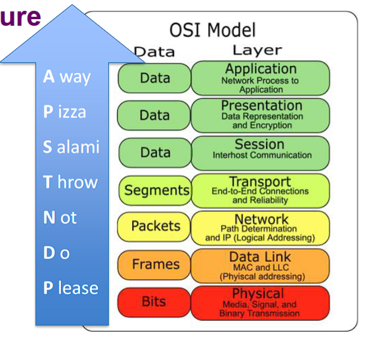

5 Layer network model:

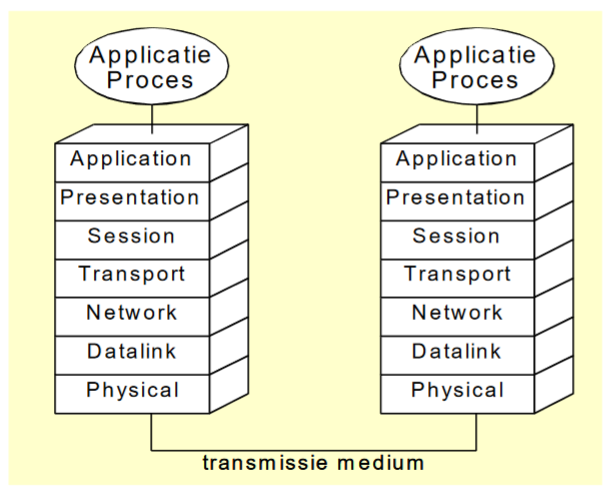

Calculate binary to decimal and hex:
- Decimal to binary: 562d 1000110010b
- Binary to decimal: 0010.0110.1110b  622d
- Hex to bin: A0 8D 10x16^3 + 0x16^2 + 8x16^1 + 13x16^0 = 41101d

ASCII: 1 character = 7 bits; Extended ASCII: 1 character = 8 bits; UTF-8: coding in 32 bits = 4 bytes

# Lecture2-Information_sources_signals_and_media
- LAN (Local Area Network): Limited size, number of users
- Internet: Combination of LAN’s, coupled networks
- Communication: Client – Server
  - Server:
    - Delivers services to client
    - No user software
    - Specific hardware, configured OS
  - Client: uses services, running user software

Network equipment
- Transportation means (media):
  - Cable
  - Glass fiber
- Switching means:
  - Hub, repeater
  - Bridge, switch
  - Router
- Network Interface (NIC):
  - Network card
- Networking software:
  - Protocols
  - Clients / server software

When such a task is in the 1. Count bits 2. Have close look at parity bit 3. When all bits are count, turn them so first bit is last and last is first

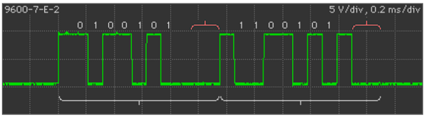

Bit <=> baud
- Bitrate: maximum number of bits per second
- Baudrate: maximum number of pulses per second

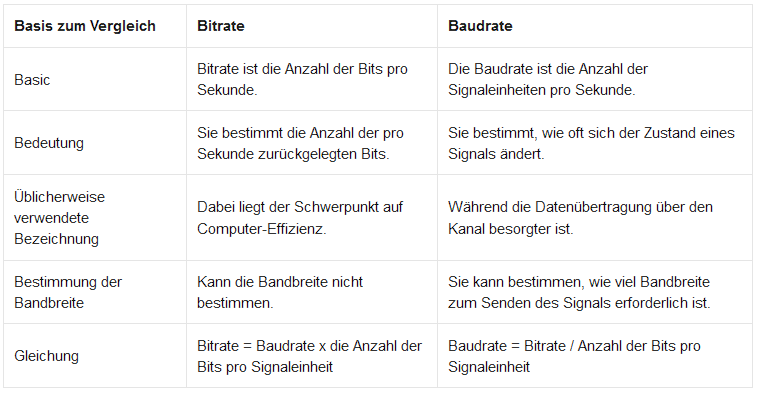

Transmission media
- Media types: 
  - Electrical:
    - Copper
    - UTP/STP
    - Coax
  - Light
    - Fiber
    - Infrared
    - Laser
  - Radio:
    - Radio Frequency Transmission
    - Microwave
    - Satellite

Copper Cables:

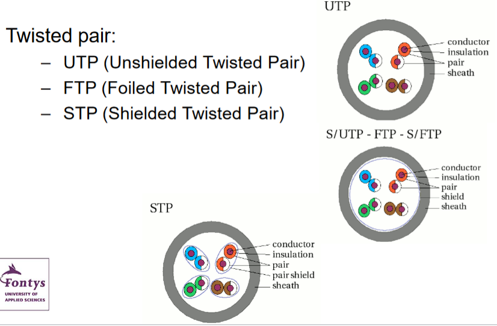

# Lecture3-Protocols_Reliability

What is a protocol
- Set of rules and procedures that organizes the communication between systems
- Implemented in software
- Both communication parties own a protocol entity (process)

Functions of a protocol
- Open and close connection
- Data transfer
- Fragment reassembling
- Routing, addressing
- Data flow control
- Error detection
- Error correction (re-transmit)
  - Order of packets 
  - Check on duplication

Encapsulation

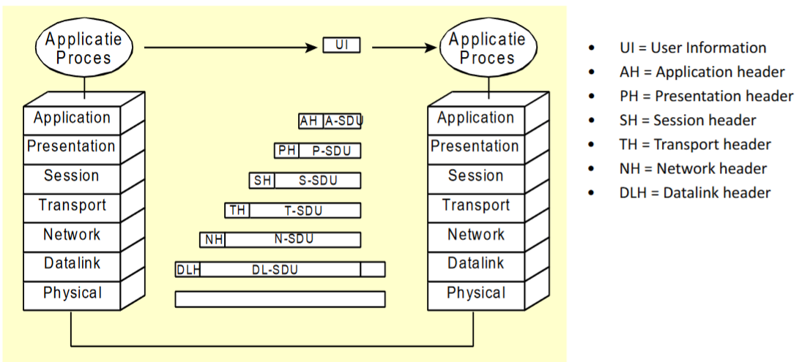

Packets/Frames

Why Packets/Frames?
- Checks
  - Error detection
  - Flow control
- Simple multiplexing
- Shared access resources

What are Frames:
- Separated pieces of data
- Put together based on 
  - Characters (ASCII): Character oriented
  - Bits: bit oriented

Transparency & character stuffing

Character stuffing: byte is added to the data section of the frame when there is a character with the same pattern as the flag 

Bit stuffing: putting more bits in data than needed to make data more clear
- Example: 01011111111110100111111111110  010111110111110010011111011111010
  - Sender: every 11111 is replaced with 111110; receiver: after every 11111 remove the next 0

# Lecture4-LANs_and_HW_Addressing
Networks
- Uses common resources, e.g., multiplexing 

How does a LAN work?
- Has a common medium
  - Copper, fiber, ether
  - Every frame reaches every station
- Addressing
  - Every station has a fixed station
  - Every frame has a destination address
  - Only the station with the correct destination address processes the frame

Access methods
- Coordination is important (only one can send at the time)
- Access strategies
  - Competing (first come, first serve)
  - Token passing
  - Reservation

Layouts of LANs (Topology)

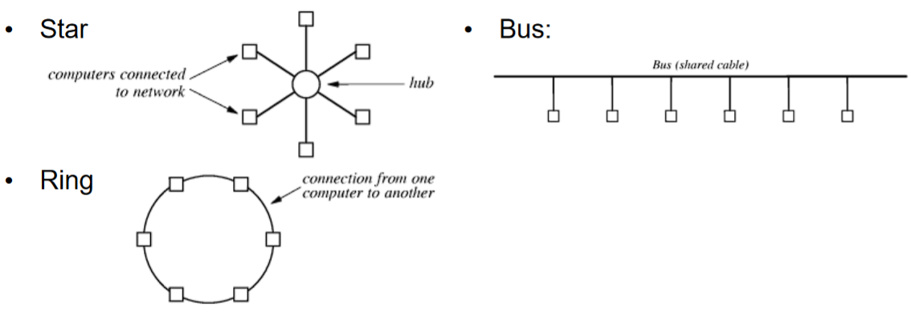

Access method – CSMA/CD
- Carrier Sense Multiple Access/Collision Detection
- Classroom example: 1. Listen 2. Nothing 3. Send Message 4. Interference with another user 5. Retry later

Wireless LAN
- Access method: CSMA/CA
- Topology: Star
- Bitrate: 11, 54, … MBits/s
- Medium: ether

Fiber Distributed Data Interface (FDDI)
- Access method: token control
- Topology: double ring
- Bitrate: 100Mbits/s 
- Medium: fiber

Asynchronous Transfer Mode (ATM)
- Topology: star
- Switched network
- Short packets with fixed length (53 byte)

Hardware Addressing
- Every NIC has a physical address
- Every frame contains sender and destination address in header

Network Interface Card (NIC)
- All stations listen to all frames
- Frames are filtered, based on MAC address
- All frames that have a different destination address are ignored

Configuring the MAC address
- Statically
  - Pre-defined by the hardware manufacturer
- Configurable
  - To be assigned by the user/administrator (e.g., ATM, WANs)
- Dynamically 
  - Is assigned at start-up (by server)

Address types
- MAC layer
  - 6 bytes long
  - Statically assigned
  - By NIC manufacturer
  - Format: **XX – XX – XX –** *XX – XX – XX* (h) (**O** = Manufacturer identification, *O* = Identifier)
- IP layer
  - 4 bytes (32 bits, IPv4) or 16 bytes (128 bits, IPv6) long
  - Dynamically or configurable assigned

Broadcasting
- What is broadcasting?
  - One station sends message to all other stations on the LAN
- Broadcasting address:
  - Specially reserved: Ethernet: FF-FF-FF-FF-FF-FF
- Data from every frame is passed through to the next layer

Frame format (ethernet):

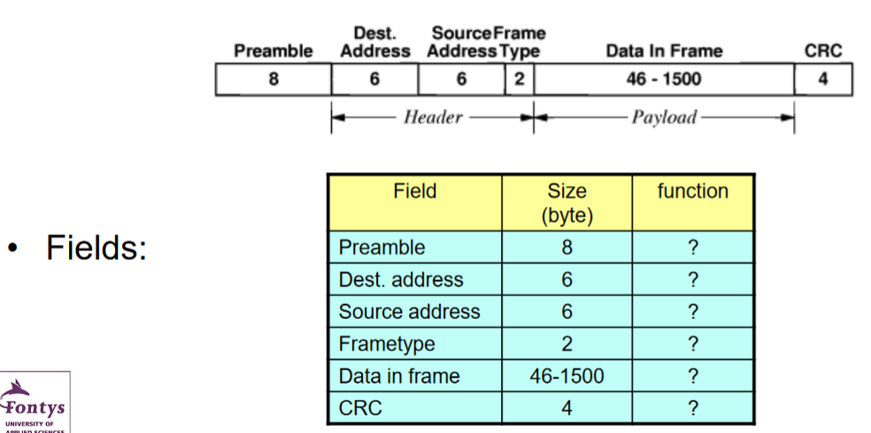

Ethernet frame types
- The value of the type field contains information about the data
- Type defined which process has to handle the data
- Most important: 
  - IPv4: 0800
  - IPv6: 86DD

# Lecture5-Wireless_Technologies

Wireless technologies: Infrared, Bluetooth, Wi-Fi

Infrared:
- Small distance (0.2m – 1m)
- Does not penetrate walls
- Night vision, Heating, Communication

Bluetooth:
- Small range (10m)
- Low power consumption
- Bandwidth 1Mhz

Wi-Fi:
- FDM (Frequency Division Multiplexing)
- Multicarrier Communication
- OFDM (Orthogonal Frequency Division Multiplexing)

FDM:
- Multiple signals split up on multiple frequencies at the same time
- Uses channels in subcarrier
  - Sub band carrier: 2,40 GHz
  - Bandwidth per band: 20 MHz
  - Most important channels:
    - Channel 1: 2401 – 2423 MHz
    - Channel 6: 2426 – 2448 MHz
    - Channel 10: 2451 – 2468 MHz
    - Channel 14: 2473 – 2495 MHz

OFDM: 
- Special form of FDM
- Subcarrier are overlapping
- More efficient, eliminates ghosting, subcarrier with conditions can work

Wi-Fi security:
- Authentication and Encryption: Open/None, WEP (outdated), WPA, WPA2
- Encryption: AES (part of WPA (2)), TKIP (outdated)

USB types: USB 1.0, 1.1, 2.0, 3.0, 3.2, 4.0

4 cables in USB: 
- Black = Ground
- Green = Data -
- White = Data +
- Red = Voltage (+5V)

Simultaneous up and downstream

Power delivered to device

Master – slave setup

# Lecture6-LAN_Equipment

Cable length and efficiency (Distortions, Absorption) is limited, so LAN equipment necessary

Modem: switches between cable types and/or cable and ether

Repeater: passes on Bits, no check

Collision domain: 
- Cabled segments that are connected using hubs or repeaters form a collision domain
- All stations in a collision domain can cause a collision between frames 
- Size: <2km

Bridge:
- Passes Frames
- Reads all frames
- Filters on destination address
- Checks CRC and only passes correct frames
- If destination unknown  always send to other side
- Learning Bridge: 

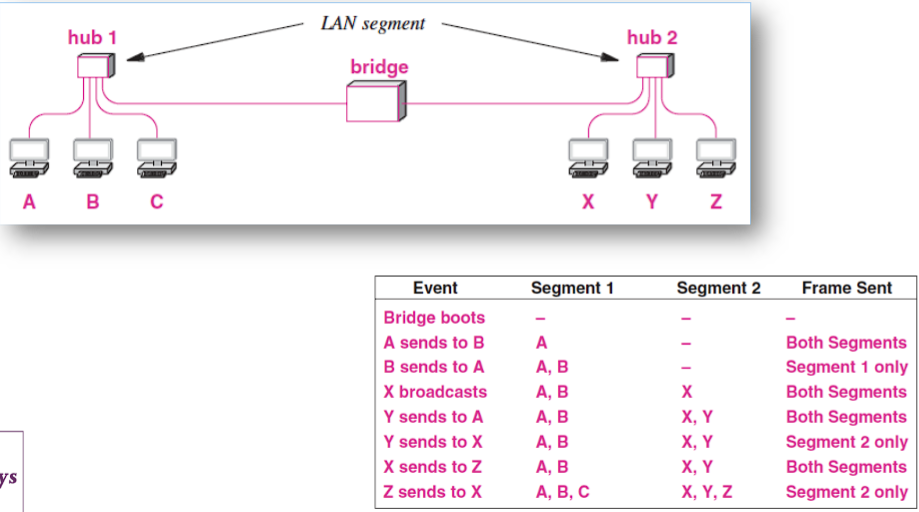

Pros and cons of bridge
- Pros: 
  - Extend range of network
  - Improves performance of network (more users and more traffic possible)
  - Multiple collision domains, both sides can send simultaneously
- Cons:
  - Introduces delay
  - Can form a bottleneck

Switch: multiport bridge 

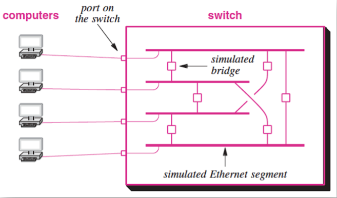

Switch bridges calculation: (n * (n-1)) / 2; n = ports

Router = Modem + SwitchMainly to transform cable to ether network

Network performance

Delays:
- Access delay
  - Dependent on usage of network
- Propagation delay	
  - Distance / speed
- Buffer delay
  - Packet length / bitrate
- Switch delay
  - Modern switches – very small (given)
- Queue delay
- Dependent on usage of switch/router

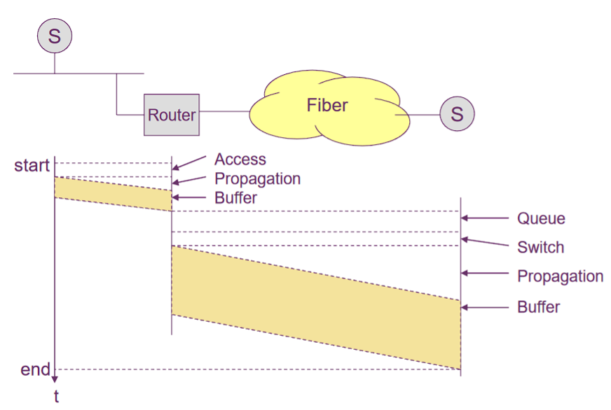

# Lecture8-Internet_Protocol

Address structure
- Hierarchical structure
- Prefix (network address)
- Suffix (host within the network)

Different notation of IP addresses:

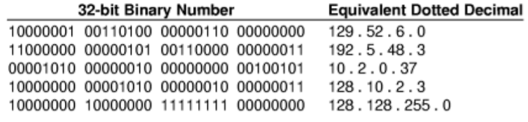

IP-Address classes:
- Class A: 0 - 127
- Class B: 128 - 191
- Class C: 192 - 223
- Class D: 224 – 239
- Class E: 240 - 255

Address space

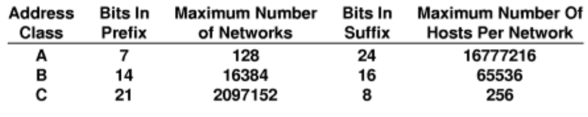

Special addresses
- Network address: e.g., 128.211.0.0
- Broadcast address: 128.211.255.255
- This machine: 0.0.0.0 (0.x.x.x)
- Loop back address: 127.x.x.x (mostly 127.0.0.1)
- Private addresses (not routed to Internet)
  - Class A: 10.0.0.0 – 10.255.255.25
  - Class B: 172.16.0.0 – 172.31.255.255
  - Class C: 192.168.0.0 – 192.168.255.255

Router addresses

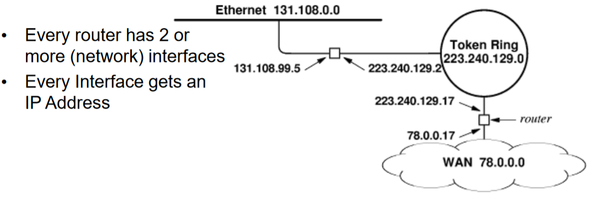

IP address crisis: more IP addresses with IPv4 necessary than available

Solutions
- Dynamical address assignment using DHCP
  - Only active hosts get an IP-Address
- CIDR = Classless Internet Domain Routing
  - Free prefix length
- IPv6
  - Address length: 128 bits (much longer than IPv4 with 32 bits)

CIDR

Problem: fixed prefix length (8, 16, 24 bits), so: waste of IP-Addresses

Solution: CIDR uses arbitrary prefix length

Notation: IP-Address / Length prefix
- E.g., 145.93.113.70/26

# Lecture9-Support_Protocols

Address Resolution Protocol (ARP): is for determine for every IP-address a MAC address
- Stored in table

Address binding
-	Within network: hardware address (MAC address)
-	Over networks: protocol address (IP-address)

Three techniques:
-	Use a table
-	Closed form calculation 
-	Exchange massages

Table: efficient
	
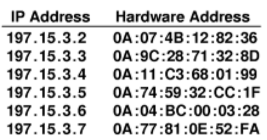

Calculation
-	Closed form calculations for configurable networks, e.g., IP = 220.123.5.x  H = x

Message exchange, used within LAN

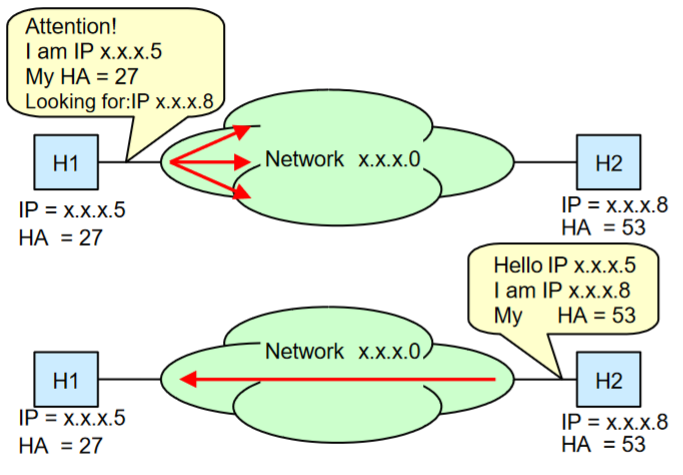

DHCP

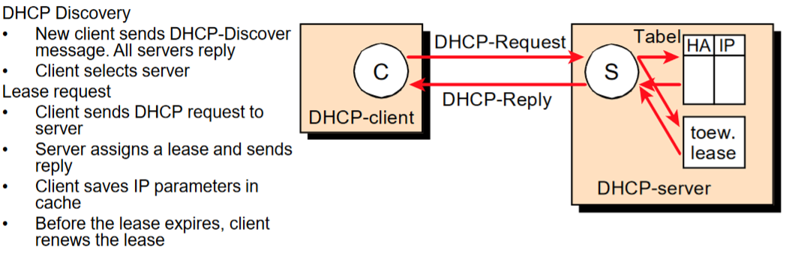

Routing with IP

IP does not offer correction of errors in the used networks and routers (Duplication of datagrams, exceptional delays, wrong order of datagrams, wrong data of datagrams, loss of datagrams)

Network Address Translation (NAT)

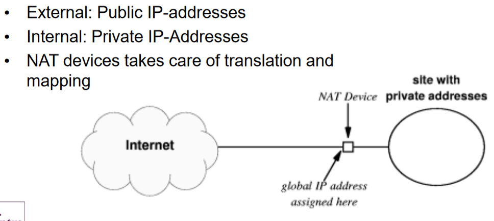

Why do we need NAT?
-	Shortage of public IP addresses
-	Security: No IP addresses visible to the outside world (combination with firewall)
-	Flexibility: IP addresses assignment not reliant on ISP (Internet Service Provider)

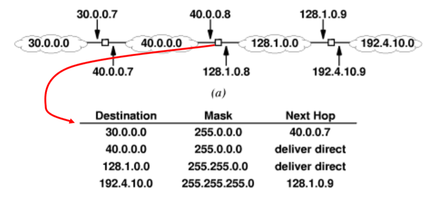

How a NAT works

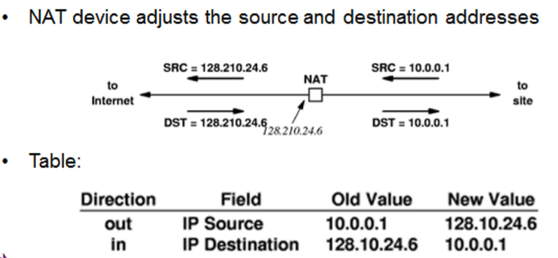

# Lecture10-IPv6
Why do we need IPv6?
-	Address space has run out
-	No security

Address space
-	IPv4
  - 32 bits addresses
  - 4,3 Billion addresses
- IPv6
  - 128 bits addresses
  - 3,4x10^(38) addresses
  - 5,6 octillion (5,6x10^(28) addresses per person worldwide

Benefits of Ipv6
-	Scalable: better hierarchical design
-	No broadcast: neighbour discovery
-	Build in security
-	Auto configuration: no ARP, DHCP
-	Enhanced routing: real time flow, e.g., video communication

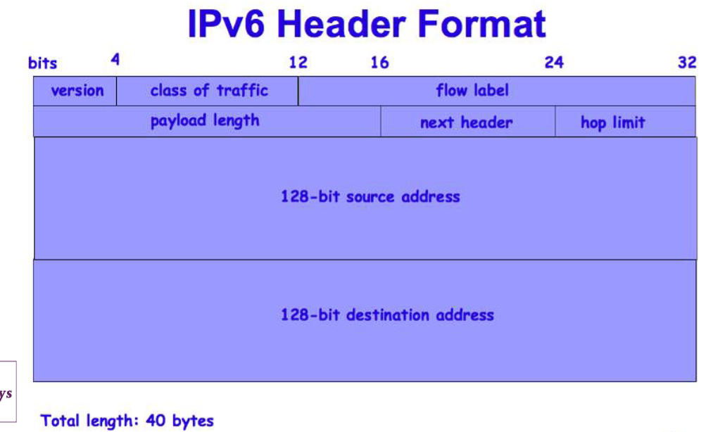

IPv6 format compared to IPv4 format

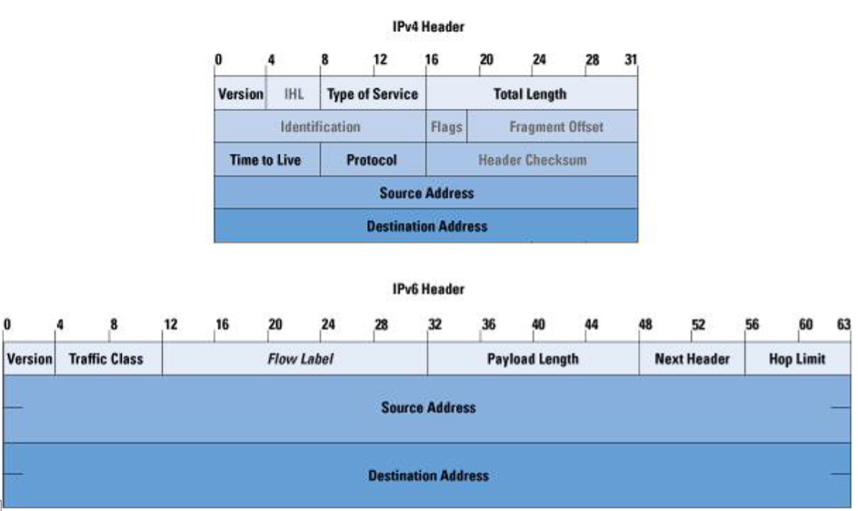

Notation of IPv6: 
-	8 fields of 4 characters (hexadecimal)
-	Case insensitive
-	Leading zeros are optional 
-	Fields of zeros can be ::
-	Example: 2001:72D3:2C80:DD02:0029:EC7A:002B:EA73
-	2001:72D3:0000:0000:0029:EC7A:002B:EA73 -> 2001:72D3::29:EC7A:2B:EA73

IPv6 address range

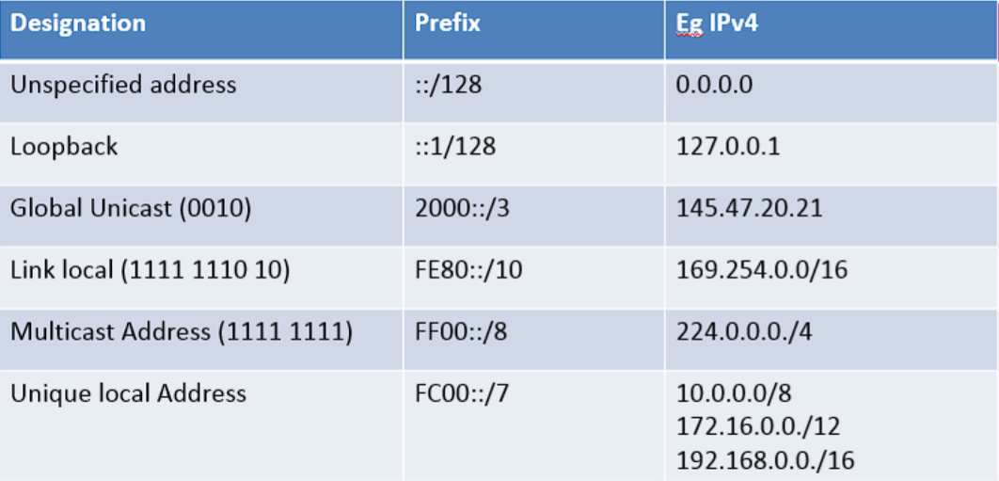

Address types
- Unicast
  - For single interface
  - Highest order bits 001
- Multicast 
  - One to many (group)
  - Subscription
- Anycast
  - One to nearest (one)

Neighbour Discovery Protocol (NDP)
-	Used to discover other hosts and routers on a local network
-	Incorporates older link-layer protocols (ARP)
-	Makes use of multicast addresses
-	Uses ICMP: Internet Control Message Protocol (e.g., ping, max hops reached

IPv6 to IPv4
-	IPv6 packet encapsulated in data of IPv4 packet
-	IPv4 destination address derived from IPv6 address 
-	Router does encapsulation

IPv6 and IPv4 can work at the same time, because routers can translate IPv4 to IPv6 and IPv6 to IPv4

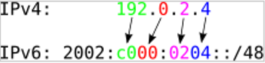

# Lecture11-UDP-TCP

Purpose transport layer
- Multiple applications use the same network connection
- Source and destination port
  - 65.000 available (per network connection)
- Segments used

Well known port numbers
- 21: FTP
- 22: SSH
- 25: SMTP
- 80: HTTP
- 443: HTTPS
- Free: above 1024

User Datagram Protocol (UDP)
-	Lightweight
-	Connectionless
-	No control when data is sent out (fire and forget)
-	Primitive error detection
-	Lost packets
-	No “in order” delivery
-	UDP header: 8 bytes
-	No setup of connection 
-	Discard corrupted segments

UDP segment

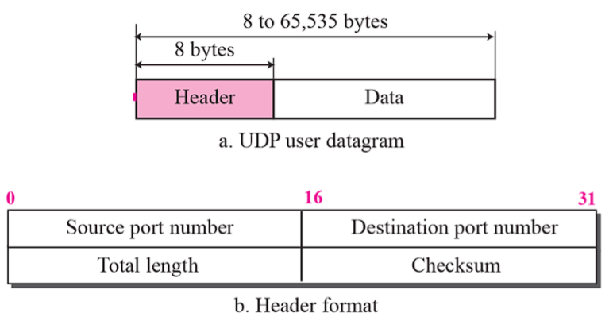

Transmission Control Protocol (TCP)
-	Connection orientation (Socket TCP-IP combination)
-	Point to point connection
-	Complete reliability
-	Full duplex communication
-	Stream interface
-	Reliable connection start-up
-	Graceful connection shutdown

How?
- Sequence number (duplication, missing, out-of-order)
-	Positive acknowledgement (retransmission for lost packets)
-	Flow control

Flow control
-	Retransmit after time finishes without receiving the ACK (acknowledgement)

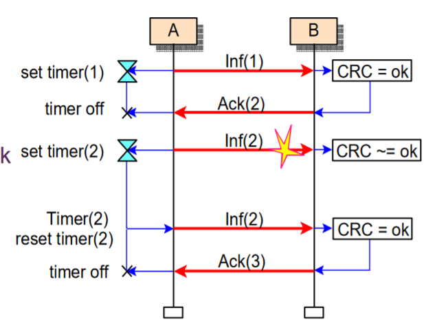

TCP uses sliding window

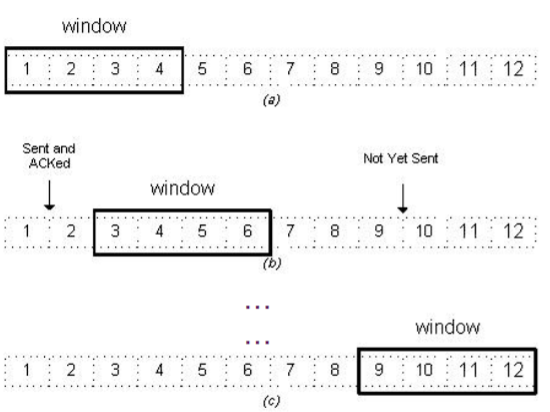

Setup connection of TCP (“Three-way handshake”)

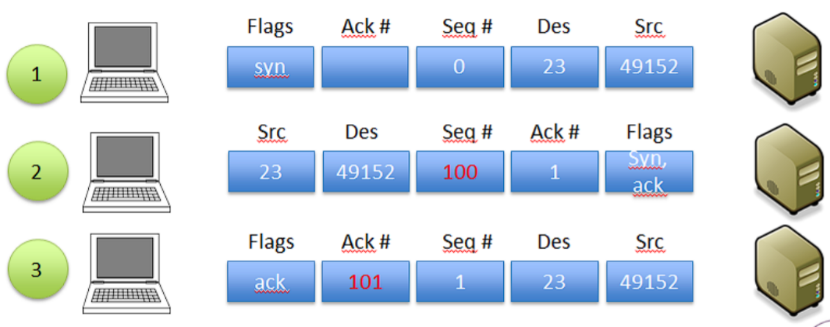

Setup/terminate connection

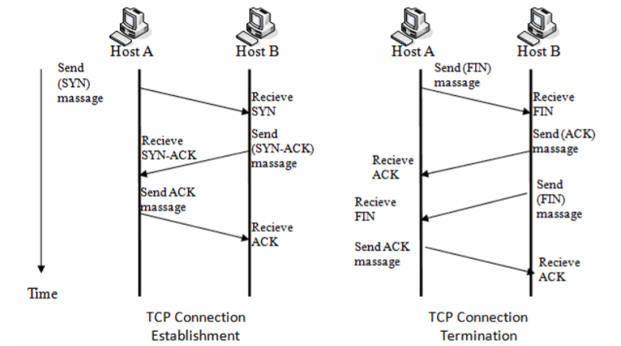

TCP segment format

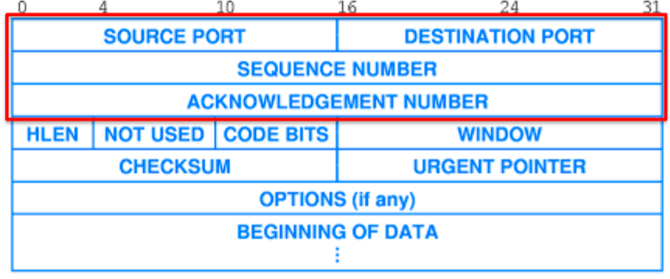

What to use for?

| What Use-Case?                         | What Protocol?                                            |
| -------------------------------------- | --------------------------------------------------------- |
| Text based communication               | TCP                                                       |
| File transfers                         | TCP                                                       |
| When acknowledgements are needed       | TCP (UDP++ to be implemented manually)                    |
| Multimedia streaming                   | UDP (or TCP when bandwidth available or when UDP blocked) |
| Small transactions (e.g., DNS lookups) | UDP                                                       |

# Lecture12-HTTP(S)

Public – Private key encryption
-	Asymmetric
-	Encrypt data
-	Authenticate clients
-	Used in: SSL/TLS

Hypertext Transfer Protocol (HTTP)
- Not encrypted
- Application Layer
- TCP/IP based
- Request/Response
- Stateless
- Request
  - Start-line: get
  - Headers accept text/html
  - Body: empty
- Response:
  - Start-line: http/version
  - Headers: accept text/html
  - Index.html

HTTPS
- encrypted
- HTTP over TLS
- HTTP over SSL
- SSL certificate needed

Symmetrical Encryption: both sides have key

Asymmetrical Encryption: one side has both keys, sends to other side and other side needs to calculate key