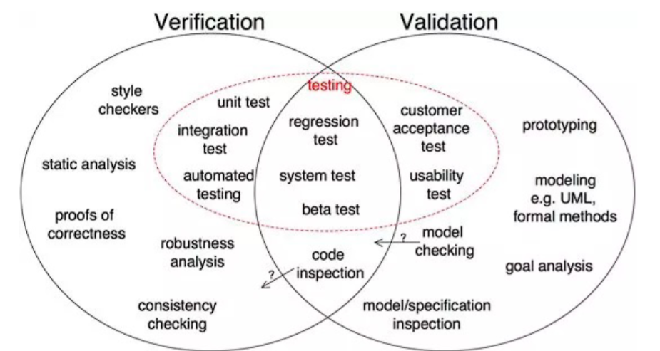

# DVPR

## 01_dvpr_introduction
- Stehen alle Infos drin, Bücher, …

## 02_pm_introduction
- What is a project? 
  - A project is a temporary endeavor undertaken to create a unique product, service or result
  - Why? To sustain business
  - Duration? End when objectives are reached or project is terminated
  - Size? Large or small, short or long, doesn’t mater
- Project Management: application of knowledge, skills, tools and techniques to project activities to meet project requirements
- Project is a success when:
  - Met Scope/Quality, Time and Cost goals  
  - Satisfied the customer/sponsor
  - Project met its main objective
- Role of Project Manager:
  - Responsible of planning, scheduling, coordinating and working with people to achieve project goals
  - 97% of successful project were led by experienced project managers
- Skills a Project Manager need:
  - Body of Knowledge (knows what a project is and what he has to do)
  - Application area knowledge, standards and regulations
  - Environment knowledge
  - General management knowledge and skills
  - Soft skills
- What helps a project to succeed: user involvement, executive support, clear business objectives, emotional maturity, optimizing scope, agile process, project management expertise, skilled resources, execution, tools and infrastructure
- Program Management:
  - Program is a group of related projects managed in a coordinated way to obtain benefits and control not available from managing them individually
  - Program manager manages project managers
  - Program example:

- Project Portfolio Management: 
  - Organizations group and manage project and programs as a portfolio of investments that contribute to entire enterprise’s success
  - Portfolio managers help organizations make wise investment decisions 

## 03_pm_basics
- Project: think, do, close (think before you act)
- 4 major anchor points to manage a project:
- Scope: 
  - Well-defined project scope is a necessity to ensure the success of the project
  - Clear vision, agreement on the outcome of the project
- How to successfully define a scope:
    1.	Identify the project needs
    2.	Confirm the objectives and goals of the project
    3.	Clear project scope description
    4.	Exceptions and acceptance
    5.	Identify constraints
    6.	Identify necessary changes
- Quality:
  - Means meeting the needs of customers (“fit for use”)
  - Can be checked by testing based on mutual approved test requirements by developer, user and project owner
- Time & Planning:
  - Think – Agree – Do/Act – Check – Deploy – Close
  - Planning must be continuous throughout the project, no plan can or should survive in its original form from the start of the project to the finish
- Money / Cost Management:
  - Process of estimating, allocating and controlling the costs
  - Allows to predict coming expenses in order to reduce the chances of it going over the budget

4 points are in “Project Devils Square”

- Need to:
  - Project organization to run the project (Demand, Supply, Project Owner)
  - Communication
  - Manage risks and issues
  - Manage changes
 
## 04_pm_basics_2
- Work Breakdown Structure (WBS):
  - Is a deliverable-oriented hierarchical decomposition of the work to be executed by the project team to accomplish the project objectives and create the required deliverables
  - Organizes and defines the total scope
  - Decomposed into work packages
- Product Breakdown Structure (PBS):
  - Tool for analyzing, documenting and communicating the outcomes of a project, forms part of product-based planning 
- Complementary: PBS  WBS 
  - PBS is identical in format of WBS, but is a separate entity, is used at a different step in planning process
  - PBS precedes the WBS and focuses on cataloguing all the desired outputs needed to achieve goal, feeds into creation of WBS, identifies the task and activities required
  - In a nutshell: PBS defines where you want to go, WBS tells you how to get there
- Example: breakdown of mountain bike 

PBS:

WBS:

- Quality review technique:
  - Structured procedure designed to access whether a deliverable is ‘fit for purpose’ or conforms to requirements
  - Can be invoked at any point during project
 
## 05_pm_methods_and_tools
- RICAD – Logging of what is happening
  - Risks
  - Issues
  - Changes
  - Actions
  - Decisions
- Risks:
  - Set of events that will have an effect on achieving the project goals
  - Uncertain event will have a positive or negative effect on project
  - Risk Log provides a record of identified risks relating to project, including status and history. Used to capture and maintain information on all the identified threats and opportunities
- Issues:
  - Term used to cover any concern, query, request for change, suggestion or off-specification raised during the project
  - Issue Log capture and maintain information of all issues being formally managed, monitored by Project Manager

Risks can be monitored by a Probability/Impact Matrix

- Changes:
  - Scope control is process of managing the scope of project when changes happen, need to set up change control process
  - When changes are uncontrolled, it’s a scope creep
  - Change management is important. Project Manager must examine proposed change and determine effect on project
  - Changes can be anything (Scope, Quality, Timelines, Money)
  - Captured in Change log
- Decisions:
  - Captured in decision log
  - Must be captured to avoid later discussions / scope creeps

## 06_pm_planning
- Importance of Project Schedules:
  - Managers want project finishing on time
  - Time has least amount of flexibility, passes no matter what happens
  - Schedule issues are main reason for conflicts
- Project Time Management Process:
  - Planning schedule management: policies, procedures and documentation for planning, executing and controlling
  - Defining activities: specific activities to produce project deliverables
  - Sequencing activities: identifying and documenting the relationships between project activities
  - Estimating activity resources
  - Estimating activity durations
  - Developing the schedule: analyzing activity sequences, activity resource estimates and activity duration estimates to create the project schedule
  - Controlling the schedule: controlling and managing changes to project schedule

## 08_agile_principles_and_mindset
- Agile Project Management: iterative development methodology that values human communication and feedback, adapting to changes and producing working results 
- Why agile?
  - Different projects – different methods
  - Better in complex projects with fast-moving environments

“Normal” project vs. Agile project:

- Advantages of agile:
  - Increase ROI (return of invest): continuous flow and focus
  - Deliver reliable results: engage customers
  - Expect uncertainty: manage with iterations and adaption
  - Unleash creativity and innovation: individuals make the difference
  - Boost performance: accountability for results
  - Improve effectiveness: practices, processes, strategies
 
Agile Triangle:

- Agile Manifesto:
  - Individuals and interactions over processes and tools
  - Working software over comprehensive documentation
  - Customer collaboration over contract negotiation
  - Responding to change over following a plan
- Agile Methodologies:
  - Scrum
  - Extreme Programming (XP)
  - Lean Product Development 
  - Kanban
  - Feature-Driven Development
- Scrum
- Three pillars:
  - Transparency
  - Inspection
  - Adaption

Scrum overview: 

- Sprint:
  - Timeboxed 1-4 weeks (most 2 weeks)
  - Mini project
  - Scope defined at beginning
  - Work will be done based on items on sprint backlog
- Scrum Roles:
  - Product Owner (demand): Product backlog, Business Value, Contact person for team (i.e., the customer)
  - Development Team (supply): Estimations, Delivers releasable increments, Interdisciplinary, Self-organizing
  - Scrum Master (service): Ensures process, Helps removing impediments, Moderation, Coaching
- Product Owner:
  - Product Owner responsible for maximizing the value of the product and work of the Development Team
  - Responsible for managing Product Backlog
- Product Backlog:
  - List of everything which might be needed for the product (Backlog Items)
  - Single source of requirements
  - Product Owner puts new Backlog Items into Product Backlog
  - Order of Product Backlog defines “importance” and thus steers which one to do next
- Sprint Planning Meeting:
  - Participants: Scrum Master, Product Owner, Development Team
  - Timeboxed: 2 hours per 1 week sprint
  - Scrum Master teaches how to stay in timebox
  - Goals: which work to complete in the next sprint and how?
  - Team decides based on capacity and velocity how much work can be done until end of next sprint
  - Outcome: Sprint Goal and Sprint Backlog
- Daily Meeting:
  - No Management reporting meeting
  - Timebox: 15 minutes
  - Questions: What did I do, what will I do, are there any Issues
  - No detailed discussions
  - Team getting informed about progress
- Review Meeting:
  - Participants: Scrum Master, Product Owner, Development Team
  - Timebox: 1 hour per 1 week
  - Team demonstrates results
  - Product Owner accepts or not accepts results
  - Probably new product Backlog Item occur
- Sprint Retrospective Meeting:
  - Most important Meeting
  - What went wright / wrong
  - Inspect and Adapt
  - Plan improvements
  - Scrum Master moderates
- Extreme Programming
- Core Values:
  - Simplicity
  - Communication
  - Feedback
  - Courage
  - Respect
- XP Roles:
  - Coach: similar to Scrum Master
  - Customer: Similar to Product Owner
  - Programmer: write and implement code
  - Testers: help customer to define acceptable tests
- Lean Product Development:
  - Eliminate waste
  - Empower the team
  - Deliver fast
  - Optimize the whole
  - Build quality in
  - Defer decisions
  - Amplify learning
- Kanban: Signboard to visualize workflow
- Feature-Driven Development (FDD)
  - First building an overall model
  - Build a feature list, plan the work
  - Design and build features

## 09_agile_value_driven_delivery
- Reason project exist is to generate business value
- Value Driven Delivery: focus on delivering value
- “Which choice will add the most value for the customer?”
- Aim to deliver highest value portions of the product ASAP (Eat your dessert first)
- Minimize waste:
  - Unclear requirements
  - Partially done work
  - Extra processes
  - Extra features
  - Task switching
  - Waiting
  - Defects
- Financial Assessment Metrics:
  - Return of Investment (ROI): ratio of the benefits from an investment to the money invested in it, higher equals better
  - Net Present Value (NPV): present value of a revenue stream (income minus costs), higher equals better
  - Internal Rate of Return (IRR): discount rate at which the project inflows and outflows are equal, higher equals better
  - Earned Value Management (EVM): measuring the cost, scope and time performance by comparing planned value, estimated costs with actual costs and earned value
- Multiple Prioritization Schemas:
  - Simple: Prio 1, Prio 2, Prio 3
  - MoSCoW: Must have, Should have, Could have, Would like to have, but not this time
  - 100 Point Method: each stakeholder has 100 Points to vote for the most important requirements
 
- Minimal Viable Product (MVP)
  - Package of functionality that is complete enough to be useful, but not represent the whole project
- Verifying and Validating Value
  - Validation: Are we building the right product?
  - Verification: Are we building the product, right?
  - Communication is important 

## 10_agile_stakeholder_engagement
- Principles of Stakeholder Engagement
  - Get the right stakeholders / stakeholder analysis
  - Cement stakeholder involvement
  - Actively manage stakeholder interest
  - Frequently discuss what “done” looks like
  - Show progress and capabilities
  - Candidly discuss estimates and projections

## 12_agile_adaptive_planning
- Timeboxing: fixed cost and timeframe
- Decomposing requirements: 
  - Work that cannot be accurately sized, estimated and planned  need to decompose or break down
- User Stories:
  - Short, simple description of a feature, from the perspective of the person who desires the new capability
  - Small chunks of business functionality within a feature
  - Agile teams break down work into user stories
  - Will be put on the prioritized product backlog
  - Format: As a `type of user`, I want `goal` so that `reason`.
- User stories should follow INVEST acronym:
  - Independent
  - Negotiable
  - Valuable
  - Estimable
  - Small
  - Testable
 
- Story points:
  - Team should own the definition of their story points
  - Story points estimates should be all-inclusive
  - When aggregating estimates, the totals do not need to match
  - Complexity, work effort and risk should be included in estimates

## 13_agile_problem_detection_and_resolution
- Technical debt
  - Backlog of work that is caused by not doing regular clean-up, maintenance and standardization
  - Backlog od things that should be done to make things easier
  - Solution: Refactoring
- Detecting problems: Lead Time and Cycle Time
- Lead Time: 
  - How long something takes to go through the entire process, e.g., from design to shipping
  - Is a tool to identify and diagnose problems
- Cycle Time:
  - Subset of Lead Time
  - How long does something take through part of the process, e.g., from coding to testing

- Cycle Time = WIP / Throughput
  - WIP = Work in progress
  - Throughput = amount of work that can be processed through a system in a given amount of time (what was done in an iteration)
- Variance Analysis: accept variance or take action?
- Best practice:
  - Do not micromanage, most variances are quite ok and normal
  - Look for external triggers
  - Decide: is it a common cause  take no action; is it a special cause (e.g., external trigger)  take action

## 14_agile_continuous_improvement
- Kaizen: Japanese process for continuous improvement, means “change for better”
- Basis for agile way of making small improvements on a daily base
- Focuses on encouraging the team frequently and implement small incremental improvements
- It is a principle, not a standardized framework
- Kaizen key to-do’s:
  - Improve the quality of your products / processes
  - Review the cost live cycle
  - Improve efficiency and productivity
  - Use training to develop people
  - Lead people to their best
  - Break down barriers
  - Give people autonomy & responsibility 
- PDCA – Cycle: four-step model for carrying out change
- No end, should be repeated over again  continuous improvement
- Procedure:
  - Plan: recognize an opportunity and plan a change
  - Do: test the change
  - Check: review the test, analyze the results and identify what you have learned
  - Act: take action based on what you learned
- If change did not work, go through cycle again to test something new
- If successful, apply it, write down findings, begin cycle again
- Process Tailoring: tailor a process to the current needs
- Not creating a completely new process, only tailor parts of it
- Changes must be documented
- Can boost flexibility and speed
- Risks:
  - Takes time
  - Can get out of hand
  - Experience is needed
- Fail Fat / Fail Forward (Learn by Doing): Do not waste too much time on lesson lend, document failures and quickly continue
- Continuous learning experience
- Adapt yourself, do not make same mistakes over again
- Individual process
- Perpetual beta (“banana principle”): buy the product before it reaches the final state
- Development continues after purchase
- Customer finances the product 
- Most common in software industry
- Alpha-/Beta-version of software application
- Six Sigma: management toll for process optimization
- DMAIC Cycle:
  - Define: identify processes which could be optimized
  - Measure: measure how the process performs until now
  - Analyze: analyze why the process is executed in its current state
  - Improve: try to find improvements which could optimize the process
  - Control & Implement: Control the new process and evaluate the impact of the change concerning to price / quality / time
- Project Pre-Mortems: exercise that aims to identify possible failure points on a project before they happen so that we can avoid or minimize those risks
  - Especially valuable on long-running projects, because more changes can happen
- Retrospective: what worked well, what did not work well, what action can we take to improve our process going forward
- 5 steps:
    1.	Set the stage: to eliminate awkwardness in team, set stage as a game to make people comfortable
    2.	Gather data: capture information from last sprint, wins and failures
    3.	Generate insight: get more insight in information and work on possible solutions
    4.	Decide what to do: create action items to work on
    5.	Close retrospective