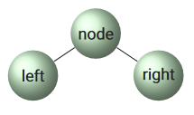

# Table of Contents
1. [Recursion and Tree traversal](#first)
2. [Intro into Sorters: Selectionsort, Insertionsort & Bubblesort](#second)
3. [Mergesort](#third)
4. [Quicksort](#fourth)

# 1. Recursion and Tree Traversal <a name="first"> </a>

## Intro Recursion

Consider the following mathematical relation, which defines the factorial of N:

```
N! = N * N(N-1)! , N >= 0 , (0! = 1)

Example:

6! = 6 * 5! = 6 * 5 * 4! = 6 * 5 * 4 * 3! = 6 * 5 * 4 * 3 * 2! = 6 * 5 * 4 * 3 * 2 * 1
   = 6 * 20 * 6
   = 6 * 120
   = 720
```

- A simple for-loop could perform this calculation
- It is always possible to transform a recursive program into a non-recursive and vice versa
- Sometimes it is much simpler to design a recursive program instead of a correctly terminated loop

## Recursive factorial method

```Java
static int factorial(int N) {
    if (N == 0) {
        return 1;
    } else {
        return N * factorial(N - 1);
    }
}
```

- This code computes 0! as a **base step**
- Before it computes N!, it computes (N - 1)!
- All the calls of the `factorial` method are temporarily stored on the method call stack

## Rules of thumb

To do recursion correctly, these properties must be satisfied:
- Explicitly solve a basic case (**base step**)
- Recursive call with *smaller* arguments
- Recursive calls should not address sub problems that overlap

## Example: Euclid's algorithm

Find the greatest common divisor of two numbers *M* and *N*, with *M > N*
- If M and N have a common divisor p, then p also is a divisor of (M mod N)
- The largest possible value of p is N
- If at some point p equals N, we have: (M mod N) = 0, and the algorithm has to stop

```Java
/**
 *  pre:  M > N
 *  post: M = gcd(M, N)
 */

// recursive method
int gcd(int M, int N) {
    if (N == 0) {
        return M;
    } else {
        return gcd(N, M % N);
    }
}

// non-recursive method
int gcd(int M, int N) {
    int h;

    while (N != 0) {
        h = N;
        N = M % N;
        M = h;
    }

    return M;
}
```

## Example: Binary Search in a sorted way

- Array: comparable items
- Search between l (left) and r (right) indices: `l <= r`
- Middle value: m = (l + r) / 2
  
```Java

// non-recursive method

int indexOf(Comparable item) {
    int l = 0;
    int r = this.size - 1;
    int m = 0;

    while (l <= r) {
        m = (l + r) / 2;
        int cmp = items[m].compareTo(item);

        if (cmp == 0) {
            break;
        } else if (cmp > 0) {
            r = m - 1;
        } else {
            l = m + 1;
        }
    }
    return m;
}

// recursive method

int indexOf(Comparable key, Comparable[] a, int lo, int hi) {
    if (lo > hi) {
        return -1;
    }

    int mid = (lo + hi) / 2;
    int cmp = key.compareTo(a[mid]);

    if(cmp < 0) {
        return indexOf(key, a, lo, mid - 1);
    } else if (cmp > 0) {
        return indexOf(key, a, mid + 1, hi);
    } else {
        return mid;
    }
}
```

## Remarks: Recursion and data structures

- Depth of Recursion: Is the maximum degree of nesting and depends on the input
- Recursive programs: Requires a push-down stack of the size proportional to the depth of the recursion
- Data structures: Are inherently recursive if the objects in it contain a reference to objects of the same type
- Therefore, Recursive programs provide a natural implementation for such data structures, e.g. a Linked List
- Be careful: The depth of the recursion could become of the order of the length of a length of a Linked List

## Example: Recursive methods for Linked Lists

```Java
// number of nodes in the list
int count(Node h) {
    if (h == null) {
        return 0;
    } else {
        return 1 + count(h.next);
    }
}

// traversing through the list
void traverse(Node h) {
    if (h == null) {
        return;
    }

    h.item.visit();
    traverse(h.next);
}

// removing a node
Node remove(Node h, Item v) {
    if (h == null) {
        return null;
    }

    if (equals(h.item, v)) {
        return remove(h.next, v);
    }

    h.next = remove(h.next, v);

    return h;
}
```

## Trees

Trees can be used:
- to describe dynamic properties of algorithms
- using and building data structures that are concrete realizations of trees
- other places: family trees, directory-file structure on computers, ...

Different types of trees:
- Binary trees
- Ternary trees
- M-ary trees
- Tries

## Definition of trees

A **binary tree** is an external node or an internal node connected to a pair of binary trees, which are called the left subtree and the right subtree of that node.

An **M-ary tree** is either an external node or an internal node connected to an ordered sequence of M trees that are also M-ary trees.

=> Recursion is a natural property of trees

## Tree traversal

Binary trees have two links and therefore have three basic orders in which the nodes can be visited:
- Pre-order:  node - left  - right
- In-order:   left - node  - right
- Post-order: left - right - node



Pre-order traversal, recursive:

```Java
void traverse() {
    traversePreR(root);
}

private void traverseR(Node h) {
    if (h == null) {
        return;
    }

    h.item.visit();
    traverseR(h.left);
    traverseR(h.right);
}
```

## Non-recursive tree traversals

Non-recursive pre-order traversal:
- In the non-recursive approach there is an explicit Stack
- The program uses the Stack to keep track of the right order to visit the nodes
- The Stack does not have a maximum size, assuming there will be no memory problem

Level-order traversal
- Another way to traverse a tree is **level-order**: From top to bottom visit each node from left to right at one level before going to the next lower level
- Here, a Queue is used, again without a maximum value

```Java
// pre-order traversal, non-recursive
private void traversePreNR(Node h) {
    Stack<Node> s = new Stack<>();
    s.push(h);

    while (!s.isEmpty()) {
        h = s.pop();
        h.item.visit();

        if (h.right != null) {
            s.push(h.right);
        }

        if (h.left != null) {
            s.push(h.left);
        }
    }
}

// in-order traversal, non-recursive
// not ideal and more complicated, recursive would be better
public void inOrderNR() {
    Stack<Node> s = new Stack<>();
    Node node = tree;

    while (!s.isEmpty() || node != null) {
        if (node != null) {
            s.push(node);
            node = node.left;
        } else {
            node = s.pop();
            System.out.println(node.item + " ");
            node = node.right;
        }
    }
}

// level-order traversal, non-recursive
private void traverseLevNR(Node h) {
    Queue<Node> q = new Queue<>();
    q.put(h);

    while (!q.isEmpty()) {
        h = q.get();
        h.item.visit();

        if (h.left != null) {
            q.put(h.left);
        }

        if (h.right != null) {
            q.put(h.right);
        }
    }
}
```

## Recursive Binary Tree algorithms

Useful basic computations and operations for binary trees:

```Java
// counting nodes
public int count() {
    return count(root);
}

private int count(Node h) {
    if (h == null) {
        return 0;
    }

    return 1 + count(h.left) + count(h.right);
}

// calculating height
public int height() {
    return height(root);
}

private int height(Node h) {
    if (h == null) {
        return -1;
    }

    int u = height(h.left);
    int v = height(h.right);

    if (u > v) {
        return u + 1;
    } else {
        return v + 1;
    }
}
```

# 2. Basic Sorters <a name="second"> </a>

## Basic Terminology

- Methods for sorting files of items containing **keys**
- Items will be sorted in such a way, that their keys are ordered according to some well-defined ordering
- Usually numerical or alphabetical order
- Sorting methods that fit into memory are called **internal sorting**
- Sorting methods using external storage, e.g. disk, are named **external sorting**
- Applied data structures for internal sorting: Arrays and Linked Lists

## Calculation of complexity for a sorting algorithm

Note that the running time of a sorting algorithm is proportional:
- to the number of **comparisons** that the algorithm uses
- to the number of times that elements are **exchanged** (or moved)
- or both of these points

## Overview of sorting methods

- Basic sorting methods: complexity O(N^2)
  - Selectionsort
  - Insertionsort
- Advanced sorting methods: complexity O * (N * log(N))
  - Mergesort
  - Quicksort
  - Heapsort
- Items to be sorted have a **key** and a **value**
- For the moment we assume that there are no duplicates in the list, so all keys are unique
- When we talk about a list, we do not refer to any implementation such as making use of a Linked List
- In all algorithms we sort for a non-decreasing list of items

## Property: Stable sorting mechanisms

**Definition**: </br>
A sorting method is said to be **stable** if it preserves the relative order of items with duplicated keys in the file
- Not all elementary sorting methods are stable
- This means that stability is a certain property without using significant extra time or space
- Instability becomes visible after two consecutive sort actions on the same list, in which the second key has duplicate values

## Stable sort example

Consider the following table:

| Column 1       | Column 2       | Column 3       |
|----------------|----------------|----------------|
| Adams - 1      | Adams - 1      | Adams - 1      |
| Black - 2      | Smith - 1      | Smith - 1      |
| Brown - 4      | Washington - 2 | Black - 2      |
| Jackson - 2    | Jackson - 2    | Jackson - 2    |
| Jones - 4      | Black - 2      | Washington - 2 |
| Smith - 1      | White - 3      | White - 3      |
| Thompson - 4   | Wilson - 3     | Wilson - 3     |
| Washington - 2 | Thompson - 4   | Brown - 4      |
| White - 3      | Brown - 4      | Jones - 4      |
| Wilson - 3     | Jones - 4      | Thompson - 4   |

- Column 1: sorted by the first key (name)
- Column 2: result of a non-stable sort of the first column on the second key (number)
- Column 3: result of a stable sort of the first column on the second key (number)

## Working process of selection sort

The idea behind Selectionsort is the following:

1. Find the smallest element in the array
2. Exchange this element with the element in the first position
3. Find the second smallest element in the array
4. Exchange this element with the element in the second position
5. etc.
6. Continue in this way until the entire array is sorted

This sorting method is calls Selectionsort because it works by repeatedly selecting the smallest remaining element

## Selectionsort program with an array data structure

```Java
public class BasicSorter<T extends Comparable<T>> {
    
    private T[] arr;
    private int N = 0;

    public BasicSorter(T[] arr) {
        this.arr = arr;
        N = arr.length;
    }

    public void selectionSort() {
        for (int i = 0; i < N; i++) {
            for (int j = i + 1; j < N; j++) {
                if (less(j, i)) {
                    exch(j, i);
                }
            }
        }
    }

    private boolean less(int a, int b) {
        return arr[a].compareTo(arr[b]) < 0;
    }

    private void exch(int j, int i) {
        T tmp = arr[j];
        arr[j] = arr[i];
        arr[i] = tmp;
    }
}
```

Notes to this implementation:
- The code is split over several methods such that the sort-method contains the essential part of the algorithm
- The implementation always does _N * (N - 1) / 2_ comparisons and possibly an equal amount of exchanges

## Selectionsort improvement

- An improvement can be made to reduce the amount of exchanges by adding a bit more memory usage: We introduce a variable `min`, where we store the momentary minimum value found. Then, if this minimum value has been found we perform only one exchange in each iteration of the outer loop
- This improvement is an example of time and space trade off: The execution time can be shortened at the expense of a bit more memory usage

The improvement:

```Java
public void selectionSort(Comparable[] arr) {
    int N = arr.length;

    for (int i = 0; i < N; i++) {
        int min = i;

        for (int j = i + 1; j < N; j++) {
            if(less(arr[j], arr[min])) {
                min = j;
            }
        }

        exch(arr[i], arr[min]);
    }
}
```

## Properties of the Selectionsort mechanism

- The inner loop is just a comparison to test a current element against the smallest element found so far (plus the code necessary to increment the index of the current element and to check that it does not extends the array bounds)
- The work moving the elements around falls outside the inner loop
- Each exchange puts an element into its final position
- The number of exchanges using the selection sort is N - 1 (no exchange is needed for the final element)
- The Selectionsort needs no extra memory

## Complexity of Selectionsort

- To calculate the time complexity, we can assume that the algorithm in action randomly permutes the items that must be sorted
- In each step 1 element might have to be exchanged
- We can state that
  - There is a maximum total of N - 1 exchanges
  - `(N - 1) + (N - 2) + (N - 3) + ... + 2 + 1 = N * (N - 1) / 2` comparisons
- The selection sort needs quadratic time in the worst and in the average case: The time complexity is *O(N^2)*
- The running time is insensitive to the input

## Insertionsort

The idea behind Insertionsort is:

- To insert the element into its proper place among the those already considered (keeping them sorted)
- In a computer implementation we need
  - To make space for the element being inserted by moving larger elements to the right
  - Then inserting the element into the vacant position

This sorting method is named Insertionsort because it works by repeatedly inserting the element to its proper place

## Example for Insertionsort

```Java
public void insertionSort(Comparable[] arr) {
    int N = arr.length

    for (int i = 1; i < N; i++) {
        for (int j = i; j > 0 && less(arr[j], arr[j - 1]); j--) {
            exch(arr, j, j - 1);
        }
    }
}
```

- The sort method does N - 1 comparisons in best case, (N - 1)^2 in worst case and (N - 1)^2 / 4 on average
- The method does at least 0 but at most (N - 1)^2 / 2 exchanges, (N - 1)^2 / 4 on average

## Improvements for Insertionsort

- Test for j > 0
  - The first improvement is the test for j > 0. The test is necessary only in case the element inserted is the smallest element in the entire array
  - A solution: sentinel at a[0]
    - One improvement is to keep the keys to be sorted in a[1] to a[N] and to put a sentinel key in a[0], making it at least as small as the smallest key in the array
    - A simple solution is to put the smallest element in the first position of the array
    - Note: Sentinels are sometimes inconvenient; The smallest key might not easily to be found
- Avoiding unnecessary exchanges
  - Successive exchanges involving the same element are inefficient. If two exchanges take place one after the other, we have:

```Java
t = a[j]; a[j] = a[j - 1]; a[j - 1] = t
```
  - Followed by 

```Java
t = a[j - 1]; a[j - 1] = a[j - 2]; a[j - 2] = t
```
  - The value of t does not change. This can be improved by shifting the elements one position to the right instead of using exchanges

## Improved code for Insertionsort

```Java
public void insertionSort(Comparable[] arr) {
    int N = arr.length;

    for (int i = 1; i < N; i++) {
        if (arr[i] < arr[0]) {
            exch(i, 0);
        }
    }

    for (int i = 1; i < N; i++) {
        int j = i;
        Comparable v = a[j];

        while (less(v, a[j - 1])) {
            a[j] = a[j - 1];
            j--;
        }

        a[j] = v;
    }
}
```

- In comparison to the first insertion sort implementation, this implementation is nearly twice faster (but still: O(N^2))
- We removed compExch operations from the inner `while`-loop
- We saw: The extra space needed to store the value of the item to be inserted made it possible to make the algorithm faster

=> Again an example of the trade off between running time and memory space

## Complexity of Insertionsort

- By applications of the improvements given, we expect each element of a random input to about halfway back, on average
- Insertionsort uses about
  - N^2 / 4 comparisons
  - N^2 / 4 half of the exchanges on average
  - twice that many at worst
- Time complexity: O(N^2)

## Bubblesort

Bubblesort works in this way:
- Keep passing through the array
- Exchanging **adjacent elements** that are out of order
- Continuing until the array is sorted

## Bubblesort implementation

```Java
public void bubbleSort() {
    for (int i = 0; i < arr.length; i++) {
        for (int j = arr.length - 1; j > i; j--) {
            compExch(j, j - 1);
        }
    }
}
```

## Properties of Bubblesort

- Suppose that we always move from right to left through the array in the inner loop
- When a smaller element is encountered during the first pass, we exchange it with the element to its left, eventually putting it into the first position of the array
- Then on the second pass, the second smallest element will be put on the second position, and so on
- Thus, N passes suffice, and the Bubblesort operates as a type of selection sort

## Complexity of Bubblesort

- The i-th Bubblesort pass requires N - i compare-exchange operations
- When the algorithm is modified to terminate when it discovers that the file is sorted, the running time depends on the input
- But the i-th pass requires N - i comparison and exchanges if the file is in reverse order
- Bubblesort uses
  - N^2 / 2 comparisons
  - N^2 / 2 exchanges on average and in the worst case
- Time complexity: O(N^2)

## Summary: Elementary sorting methods

The time complexity of a sorting algorithm is proportional
- to the number of comparisons that the algorithm uses
- to the number of times that items are moved or exchanges
- or both

|               | Comparison                   | Exchange                     | Complexity |
|---------------|------------------------------|------------------------------|------------|
| Selectionsort | N^2 / 2 in ac & wc           | N in ac & wc                 | O(N^2)     |
| Insertionsort | N^2 / 4 in ac; N^2 / 2 in wc | N^2 / 4 in ac; N^2 / 2 in wc | O(N^2)     |
| Bubblesort    | N^2 / 2 in ac & wc           | N^2 / 2 in ac & wc           | O(N^2)     |

**ac**: Average case </br>
**wc**: Worst case

# 3. Mergesort <a name="third"> </a>

## Word definitions

- Merging: Take two sorted data structures and fill one new data structure, which will then be sorted too
- Mergesort: Repeatedly merge two parts of a data structure in a systematic way to sort the whole data structure

## Merge sort

```Java
void sort(Comparable[] a, Comparable[] aux, int lo, int hi) {
    if (hi <= lo) {
        return;
    }

    int mid = (lo + hi) / 2;

    sort(a, aux, lo, mid);
    sort(a, aux, mid + 1, hi);

    merge(a, aux, lo, mid, hi);
}

private void merge(Comparable[] a, Comparable[] aux, int lo, int mid, int hi) {
    for (int k = lo; k <= hi; k++) { // copy a[] to aux[]
        aux[k] = a[k]
    }

    int i = lo;
    int j = mid + 1;

    for (int k = lo; k <= hi; k++) { // merge back to a[]
        if (i > mid) {
            a[k] = aux[j++];
        } else if (j > hi) {
            a[k] = aux[i++];
        } else if (less(aux[j], aux[i])) {
            a[k] = aux[j++];
        } else {
            a[k] = aux[i++];
        }
    }
}
```

- The merge method merges the array ranges: `[lo ... mid] & [mid + 1 ... hi]`
- The array `aux` is an auxiliary array, so additional storage is used
- When the Mergesort is imagined as a tree, this is the top-down approach. It is also possible to create a bottom-up approach:

```Java
// non-recursive
void sort(Comparable[] a) {
    int N = a.length;
    Comparable[] aux = new Comparable[N];

    for (int n = 1; n < N; n = n + n) {
        for (int i = 0; i < N - n; i += n + n) {
            int lo = i;
            int m = i + n - 1;
            int hi = Math.min(i + n + n - 1, N - 1);

            merge(a, aux, lo, m, hi);
        }
    }
}
```

# 4. Quicksort <a name="fourth"> </a>