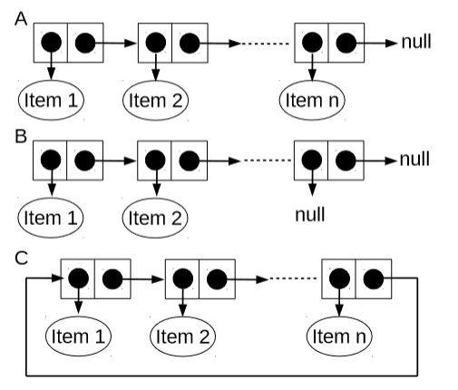
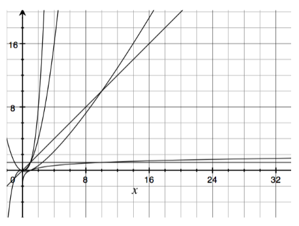
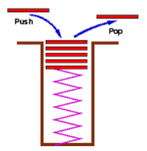
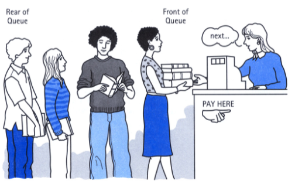
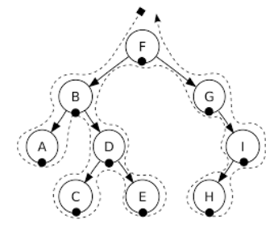
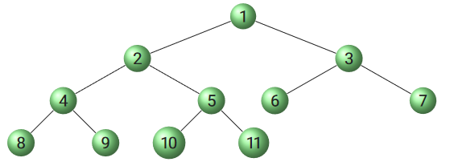

# Table of Contents

1. [Introduction of ALDA](#first)
2. [Data Structures: Arrays & Linked Lists](#second)
3. [Complexity](#third)
4. [Data Structures: Stacks, Queues & Bags](#fourth)
5. [Data Structures: Trees, Symbol table & Binary Search Tree](#fifth)

# 1. ALDA_Introduction <a name="first"> </a>

## Algorithm definition

- Used in computer science to describe a problem-solving method suitable for an implementation as a computer program
- Method or program to calculate a (mathematical) problem using a certain computational model
- Implements a (mathematical) function
- Implements operations to transform data via (pre-) defined operations
- Examples:
  - Operations on basic data structures, e.g. stacks and queues
  - Sorting algorithms with an appropriate data structure
  - Searching algorithms
  - Graph algorithms: shortest path, search in a network, ...

## Typical operations on data

- Creation / Initialization
- Reading / Retrieving
- Updating (often achieved by deleting and (re-) creation)
- Deleting
- Searching
- Sorting
- Union and intersection of sets
- Traversal of certain data structures, like trees and graphs

# 2. DataStructures_1 <a name="second"> </a>

## Abstract Data Type (ADT)

- Defines a type (name) and corresponding methods
- Does not define a certain data structure
- Fundamental concept of object-oriented programming
- Like a java interface, but extended with constructor(s)
- Is an API for one type

## Java and ADTs

How does Java support the need for an ADT?

- A Java interface: declares methods to be implemented
  - These methods are public
  - The interface may be package-private
  - There is no constructor defined
- An implementation for all the methods in the interface by a class to be used by a client
- A client program knows the public methods in the interface and can make use of the class that implements the interface
- This is a good approach: to work at a higher level of abstraction, so separate different parts of a complex system
  
Question: why is a constructor never part of an interface?

- Because no data members in an interface to initialize
- All data members in interfaces are public static final by default

## Arrays

- A linear sequence of objects of the same type
- Size set at initialization and cannot be changed
- Items can be accessed through an integer index, ranging from 0 to n-1
- Time needed to access an item is independent from the index value
- Notation: Elements of an array `a` are:

```java
a[0], a[1], a[2], ..., a[n-3], a[n-2], a[n-1]
```

### Example: Sieve of the Eratosthenes

- Algorithm to get prime numbers of a pre-defined number range:

```java
int n = 100;
boolean[] a = new boolean[n];

for (int i = 0; i < n; i++) {
  a[i] = true;
}

for (int i = 0; i < n; i++) {
  if (a[i] != false) {
    for (int j = i; i * j < n; j++) {
      a[i * j] = false;
    }
  }
}
```

## Linked Lists

- Most important attributes of a Linked List:
  - Linear structure: every list node points to the next list node
  - Simple operations, like insert and remove
  - Head and tail conventions in Linked List
- Most important basic operations
  - List element insertion
  - List element deletion
- Elementary list processing - some important operations
  - List reversal and list traversal
  - List insertion sort (sort while adding)
- Circular-list class
- Skip lists
- Memory allocation for lists (lists can grow, arrays cannot)

### Example of class with Linked List data structure

```java
public class LinkedList<E> {

  private static class Node<E> {
    E item;
    Node<E> next;

    Node(E pItem) {
      this.item = pItem;
      next = null;
    }
  }

  private Node<E> list;

  public LinkedList() {
    this.list = new Node<>(null);
  }
}
```

## Data structures: Linked List & array

A Linked List as a **data structure** and a **general purpose** Linked List class are two different things:

- As a **data structure**: a Linked List is just one Node class with a next attribute of type Node. No getters or setter or other methods, only a constructor is needed. It's only purpose of existence it to be used in an algorithm. A private static inner class is enough
- A **general purpose** Linked List consists of much more code and is complexer. It should function in every possible way, so it is intentionally robust, like the Linked List that is provided in the <ins>java.util.LinkedList</ins> package

## Head / Tail / Circular convention

- First node of the list can contain the first item of the list, but can also always be *null*
- If the first node never contains an item, this node is called the **dummy head**. In this case, the first item is stored in the second node
- Same with tail: last node can never contain an item, which is the called the **dummy tail**. Here, the last item is stored in the next-to-last node
- If **Circular convention** is used, the last node points to the first, creating a circle

## Options of the final node on Linked Lists



- A: "Normal" Linked List, no conventions
- B: Tail convention with dummy tail
- C: Circular convention

## Java - Linked List deletion

- Node reference x points to the node, that has it's next node reference pointing to the node that we want to remove
- To remove the node following node x, we use the statements:

```java
temp = x.next;
x.next = temp.next;
```

- or simply

```java
x.next = x.next.next;
```

## Java - Linked List insertion

- To insert a node t into a list at a position following node x, we use the statements:

```java
t.next = x.next;
x.next = t;
```

## Elementary List Processing

- Linked Lists as easier re-arrangeable data structures
- Instead of avoiding an `IndexOutOfBoundsException` with arrays with Linked Lists we have to check the references in the list
- Basic operations on lists:
  - List traversal
  - Add and delete items
  - Usage of insertion sort algorithm

## List traversal

- As a contrast to arrays, a method to traverse the list is needed
- If **x** refers to the first node of a list, the final node has a null link

```java
Node t = x;

while(t != null) {
  visit(t.item);
  t = t.next;
}
```

## Head and tail conventions in Linked Lists

- Circular, never empty Linked List
- Linked List with head reference and dummy tail (most common approach)
- Linked List with dummy head and dummy tail
- Linked List with dummy head and tail nodes

## Head and tail conventions: circular lists

- First insert:

```java
head.next = head;
```

- Insert t after x (t and x are node references, t is a new node):

```java
t.next = x.next;
x.next = t;
```

- Remove after x:

```java
x.next = x.next.next;
```

- Traversal loop:

```java
t = head;

do {
  ...
  t = t.next;
} 
while (t != head);
```

- Test if one item:

```java
head.next == head;
```

## Head and tail conventions: dummy tail

- Initialize:

```java
head = null;
```

- Insert t after x (t and x are node references, t is a new node):

```java
if (x == null) {
  head = t;
  head.next = null;
} else {
  t.next = x.next;
  x.next = t;
}
```

- Remove after x:

```java
t = x.next;
x.next = t.next;
```

- Traversal loop:

```java
for (t = head; t != null; t = t.next) {
  ...
}
```

- Test if empty:

```java
return head == null;
```

## Head and tail conventions: dummy head and dummy tail

- Initialize:

```java
head = new Node();
head.next = null;
```

- Insert t after x (t and x are node references, t is a new node):

```java
t.next = x.next;
x.next = t;
```

- Remove after x:

```java
t = x.next;
x.next = t.next;
```

- Traversal loop:

```java
for (t = head.next; t != null; t = t.next) {
  ...
}
```

- Test if empty:

```java
return head.next == null;
```

## Josephus problem

- The josephus problem refers to the problem to select someone to be a leader
- The identity of the elected leader is a function of *N(=9)* and *M(=5)*
- In a range from 1 - 9, one possible outcome can be `5, 1, 7, 4, 3, 6, 9, 2`
- In code:

```java
public class Josephus {
  private static class Node {
    int val;
    Node next;

    Node(int v) {
      this.val = v;
    }
  }

  ...

  public int selectNext(int N, int M) {
    Node head = new Node(1);
    Node current = head;

    for (int i = 2; i <= N; i++) {
      current.next = new Node(i);
      current = current.next;
    }

    current.next = head;

    while (current != current.next) {
      for (int i = 1; i < M; i++) {
        current = current.next;
      }

      current.next = current.next.next;
    }

    return current.val;
  }
}
```

## Possible extension: double Linked List

- By adding more links, we can add the capability to move backwards through a Linked List
- We can support operations to *"find the item before a given item"* by using a doubly Linked List in which we maintain two links for each node:
  - One (`prev`) to the previous item
  - Another (`next`) to the next item
- With dummy node or a circular list, we can ensure that `x`, `x.next.prev`, and `x.prev.next` are the same for every node in a doubly Linked List
- We then must modify or implement the operations
  - `remove`
  - `insert after`
  - `insert before`

# 3. Complexity of Algorithms <a name="third"> </a>

## Analysis of algorithms: the goals

- Perform efficiency analysis
- Compare different algorithms fir the same task
- Predict their efficiency independent of the environment
- Two approaches:
  - **Empirical** analysis: by using an existing implementation
  - **Theoretical** analysis: before any implementation

## Analysis of algorithms

- How to consider the properties of algorithms?
  - Analyse the operations on data
  - What do we know about the expected input data?
- How to determine the efficiency of algorithms?
  - Execution time: how does it increase if the data increases?
  - Memory usage: how does it increase if the data increases?
- If we have an implementation: empirical analysis
- Analysis of algorithms before implementation
  - Find the complexity: how does execution time grow if the size of the data grows?
  - Big-Oh notation, useful in derivation of the complexity

## Empirical analysis

- Start with existing code
- What can be detected by empirical analysis?
- What is the benefit of an actual running time evaluation?
- Assume that two algorithms are given to solve the same problem:
  - We run them both to see which one takes longer
  - If an algorithm is 10 times faster than another, this unlikely escapes the notice of someone who waits 3 seconds for one to finish and 30 seconds for the other to finish
  - Is this true for all possible input data and for both algorithms?
  - Example: summation of a finite row of numbers

### Example: Gaussian sum

Summation of a finite series: `1 + 2 + 3 + 4 + 5 + ... + n`

```java
public int gaussianSumSimple(int n) {
  int sum = 0;

  for (int i = 1; i <= n; i++) {
    sum = sum + i;
  }

  return sum;
}
```

**Theoretical analysis**: If *N = 30*, then the numbers of additions when the loop is executed is 30. If *N = 30*, then it is 300. --> 10 times as much </br>
**Equal to the growth in N, which means a linear growth** </br>
**Empirical analysis**: Tun both programmes for different values on *N* and measure the execution time

## The number N

- Also known as 'size' of the problem
- *Problem*: As in math, the algorithm we want to implement
- *Size*: N, of the data structure when it is completely filled with the items we are going to use in the algorithm. In the Gaussian Sum example: just the number of integers we are adding to get the sum of them all

## Gaussian Sum Formula

A bit of secondary school math:

```
    sum(N) =   1   +   2   +   3   + .... +  N-1  +   N
    sum(N) =   N   +  N-1  +  N-2  + .... +   2   +   1

2 * sum(N) = (N+1) + (N+1) + (N+1) + .... + (N+1) + (N+1)

2 * sum(N) = N * (N + 1) => sum(N) = N * (N + 1) / 2
```

### Example: Gaussian sum formula

Summation of a finite row of numbers, second implementation

```java
public int gaussianSum(int n) {
  int sum = 0.5 * n * (n + 1);
  return sum;
}
```

**Theoretical analysis**: One addition and two multiplications are needed. Value of *N* does not influence the execution time

Number of operations needed is **independent of the value n**. Complexity is **constant**: no growth

## Empirical analysis

- Empirical analysis takes a significant amount of time
  - Algorithms need to be implemented first
  - Time between tests, can take hours or even days
- 3 different choices for input data:
  - Actual data: enable us to measure the running time of the program as in its future system
  - Random data: make sure that our experiments test the algorithms, not the data
  - Perverse data: assure us that our program can handle any input

## Summary summation example

- In the first implementation we see a relation between the expenditure and the size of the input, i.e. the expenditure grows with increasing N. The expenditure grows linear
- In the second implementation the calculation method is independent of the size N. The expenditure is constant
- Apparently the running time depends on the input. It is not always possible to rule this out, but at least we can give it a try

## Theoretical analysis of algorithms

How to do this analysis of algorithms?

- In the analysis of an algorithm we must identify the operations that matter
- The number on operations involved can be large, but the performance of an algorithm mainly depends on loops
- The analysis starts with looking at the structure of the algorithm, e.g. are loops performed as a next statement or as a statement inside another loop?
- Worst-case analysis can be done by determination of **time complexity** (upper bound dependent on the chosen input parameter N) or **space complexity** (upper bound in dependent of the use of storage)
- We will see that the results of
  - 'Time complexity' can be converted to 'space complexity' and
  - 'Space complexity' can be transferred to 'time complexity'
- More concrete:
  - If you minimize the data structure, the operations could become more complex, which could take more time to complete
  - If you add some memory space, the implementation could become simpler and faster, and also less error prone

## Growth functions

A simple mathematical function is used to denote the complexity of algorithms

- Most algorithms have a *primary parameter N*, the 'size of the problem', that affects the running time most significant
- The *parameter N* might be:
  - The size of a file to be sorted or searched
  - The number of characters in a text string
  - Some other measure of the size of the problem being considered
- Usually **N** is directly proportional to the size of the data set being processed

## Dimension of the problem

- Our goal is to express the resource requirements (mostly time, but also space) in terms of *N*, using mathematical formulas
- We are only interested in large values of N
- We can use the following functions to make classifications for all algorithms:



- The functions are: 1, *log(x), x, x* log(x), x^2, x^3, ...*

## Formulas from the Gaussian sums

- The first implementation had a linear running time, which means the formula is *N*
  - When a limited amount of processing is done on each input element, the running time of the program is linear. This running time occurs e.g. in a method where we search a value in an array or list
- The second implementation had a constant running time, which means the formula is *1*
  - Most instructions of most programs are executed once or at most only a few times. If all the instructions of a program have this property, we say that the program's running time is constant
  - Doubling the input length *N* hardly influences the running time

## Binary search algorithm: again a loop

The growth of the following implementation is *log(N)*:

```java
public int binSearch(int key) {
  int left = 0;
  int right = ar.length;
  int mid;

  while (left + 1 != right) {
    mid = (left + right) / 2;
    
    if (ar[mid] <= key) {
      left = mid;
    } else {
      right = mid;
    }
  }

  return left;
}
```

The algorithm has a logarithmic running time

- When the running time of a program is logarithmic, then the running time grows slower than any positive power of the N
- Binary search is most famous example for logarithmic running time

## Growth function: N * log(N)

- The N * log(N) running time can arise when algorithms solve a problem by breaking it into smaller subproblems, solving independently, and then combining the solutions
- When N doubles, the running time grows a bit more, but always slower than N to a power above 1
- Example: good sorting methods, e.g. Quicksort and Heapsort

## Example: Method to get distinct triples

```java
// return number of distinct triples (i, j, k)
// such that a[i] + a[j] + a[k] = 0

public int count(int[] a) {
  int N = a.length;
  int cnt = 0;

  for (int i = 0; i < N; i++) {
    for (int j = i + 1; j < N; j++) {
      for (int k = k + 1; k < N; k++) {
        if (a[i] + a[j] + a[k] == 0) {
          cnt++;
        }
      }
    }
  }

  return cnt;
}
```

Growth functions: N^2 and N^3

- N^2:
  - When the running time of an algorithm is quadratic, that algorithm is of practical use for only relatively small problems
  - Quadratic running times typically arise in algorithms that process all pairs of data
  - Example: two nested loop in Bubblesort
- N^3:
  - Similarly, an algorithm that processes triples of data items (perhaps in a triple-nested loop, like in the example) has a cubic running time. When N doubles, the running time increases eightfold

## Values of commonly encountered functions

| N       | log(N) | sqrt(N) | N * log(N)  | N * (log(N))^2 | N^2            |
| ------- | ------ | ------- | ----------- | -------------- | -------------- |
| 10      | 3      | 3       | 33          | 110            | 100            |
| 100     | 7      | 10      | 664         | 4.414          | 10.000         |
| 1.000   | 10     | 32      | 9.966       | 99.317         | 100.000        |
| 10.000  | 13     | 100     | 132.877     | 176.533        | 1.000.000      |
| 100.000 | 17     | 316     | 1,66 * 10^6 | 2,76 * 10^7    | 10.000.000.000 |

If these values are in milliseconds, then N * log(N) for 100.000 entries would take roughly 28 Minutes

## Big-Oh Notation

- Big-Oh notation to compare the efficiency of algorithms
  - In the most cases the implementation of the operations on the data structure determines the efficiency of algorithms
  - On the other hand the choice of the underlying data structure also influences the efficiency. This means if we decide to change the data structure, algorithms can become 'faster'

## Big-Oh notation of f(N)

- To bound the error that we make when we ignore small terms in formulas
- To bound the error that we make when we ignore parts of program that contribute a small amount to the total being analysed
- To allow us to classify algorithms according to upper bounds on their total running times
- 'Fast' and 'slow' is determined, which is given by O-notation: *O(f(N))* -> "big Oh of f(N)
  - The O-notation denotes the relation 'is proportional to'

## Examples for O-notation

- Essentially, we can expand expressions using O-notation as through the O were not there, then drop all but the largest term
- For example, if we expand the expression:

```
(O(N) + O(1)) * (O(N) + O(1))
```

- we get four terms:

```
     O(N)  * O(N) + O(N) * O(1) + O(1) * O(N) + O(1) * O(1)
<=> O(N^2) + O(N) + O(N) + O(1)
<=> O(N^2) +  2   * O(N) + O(1) 
```

- Result: `O(N^2) + 2 * O(N) + O(1)`
- We can drop all terms but the largest O-term, which then results in `O(N^2)`
- This is the dominant term or largest value of N
- We refer to a formula with one O-term as an <ins> asymptotic expression </ins>

## Big-Oh notation in code

We will use again the sieve of eratosthenes:

```java
int n = 100;                            // O(1)
boolean[] a = new boolean[n];           // O(1)

for (int i = 0; i < n; i++) {           // O(N)
  a[i] = true;
}

for (int i = 0; i < n; i++) {           // O(N)
  if (a[i] != false) {                  // O(1)
    for (int j = i; i * j < n; j++) {   // O(sqrt(N))
      a[i * j] = false;                 // O(1)
    }
  }
}
```

# 4. DataStructures_2 <a name="fourth"> </a>

## Rerun: data structures
- Basic data structures:
  - Array
  - List
- Elementary data structures
  - Stack (LIFO)
  - Queue (FIFO)
  - Bag (just a bag to throw items in)
- Higher-structured data structures
  - Tree
  - Hash (a key-value storage structure)
  - Heap (priority queue)
  - Trie (a data structure where keys are strings)

## Simple Stack

- Last in first out principle (LIFO)
- Stack ADT:
  - Push method: Add an item to the stack
  - Pop method: Remove and get an item of the stack
  - isEmpty method: Check if the stack is empty
  - isFull method: Check if the stack is full (only possible if the stack is finite)



## For what purposes are stacks needed

- Storing items that have to be used later on in some kind of process
- Storing actions that might need to be redone (undo-redo stacks)
- As a temporary data structure in an algorithm to save intermediate results
- ...

## Abstract Data Type Stack

**Stack with focus on the most prominent operations** </br>
A push-down stack is an ADT that comprises two basic operations: **push** (insert) an item and **pop** (remove & return) the last inserted item </br>
Definition of a finite generic stack as an ADT interface:

```java
adt Stack {
  Stack(int size)    // constructor, sets size
  void push(item)    // to insert an item
  item pop()         // to remove and get the last inserted item
  boolean isEmpty()  // to check if the stack is empty
  boolean isFull()   // to check if the stack is full
}
```

The stored items are yet unknown type. We could define a stack for a specific type of item. If we like to store parenthesis, we need a push-down stack based on the type `char`

## Transform ADT to Java interface

```java
interface Stack<E> {
  void push(E item);
  E pop();
  boolean isEmpty();
  boolean isFull();
}
```

Now, the ADT is a usable java interface. The interface is also generic to make the data structure usable for every data type while also maintaining type safety.

## Array implementation of a string stack 1

```java
public class StackImpl<String> implements Stack<E> {

  private String[] s;  // holds items
  private int n;       // number of items in stack

  public StackImpl(int capacity) {
    s = new String[capacity];
  }

  public void push(String item) {
    s[n++] = item;
  }

  public String pop() {
    return s[n--];
  }

  public boolean isEmpty() {
    return n == 0;
  }

  public boolean isFull() {
    return n == s.length;
  }
}
```

This first implementation has memory leaks in the statements `s[n++] = item` and `s[n--]`, which are logically correct, but do not work like intended. To solve this, the methods can be rewritten into the following code:

```java
public void push(String item) {
  s[n] = item;
  n++;
}

public String pop() [
  n--;
  String value = s[n];
  s[n] = null;
  return value;
]
```

## Complexity: Array or Linked List implementation

**Complexity of push & pop:** </br>
We can implement the push and pop operations for a push-down stack ADT in a <ins>constant time</ins>, using either arrays of Linked Lists

## Queue

- A queue is a first in first out data structure (FIFO)
- A queue is a buffer for waiting



## ADT & Java interface for a queue

```java
adt Queue {
  Queue()          // constructor
  boolean empty()  // checks if the queue is empty
  void put(item)   // adding an item to the end of the queue
  item get()       // getting the item at the start of the queue
}

interface Queue<Item> { // java interface using "item" as data type
  boolean empty();
  void put(Item item);
  Item get();
}
```

## Implementation of queues

- array implementation:

```java
public class ArrayQueue<Item> implements Queue<Item> {
  private Item[] q;
  private int n = 0;      // size of queue
  private int first = 0;  // index of first item
  private int last = 0;   // index of last item

  public void put(Item item) {
    if (n == q.length) {    // resize if necessary
      resize(2 * q.length);
    }

    q[last++] = item;
    
    if (last == q.length) {
      last = 0;
    }

    n++;
  }

  public Item get() {
    if (isEmpty()) {
      throw new NoSuchElementException("Queue underflow");
    }

    Item item = q[first];
    q[first] = null;
    n--;
    first++;

    if(first == q.length) {  // wrap around
      first = 0;
    }

    if (n > 0 && n == q.length / 4) {
      resize(q.length / 2);
    }

    return item;
  }

  private void resize(int max) {
    Item[] temp = (Item[]) new Object[max];

    for (int i = 0; i < n; i++) {
      temp[i] = q[(first + i) % q.length];
    }

    q = temp;
    first = 0;
    last = n;
  }
}
```

--> The array is in fact a so called 'circular buffer': The first and last indices will move around in the array after a number of put and get operation calls

- Linked List implementation:

```java
public class LLQueue<Item> implements Queue<Item> {
  
  private static class Node {
    Item item;
    Node next;

    Node(Item pItem) {
      this.item = pItem
      next = null;
    }
  }
  
  private int n = 0;    // size of queue
  private Node head;
  private Node tail;

  public void put(Item item) {
    Node oldLast = tail;
    tail = new Node(item);

    if (isEmpty()) {    // check if head is null
      head = tail;
    } else {
      oldLast.next = tail;
    }

    n++;
  }

  public Item get() {
    if (isEmpty()) {
      throw new NoSuchElementException("Queue underflow");
    } else {
      Item item = head.item;
      head = head.next;
      n--;

      return item;
    }
  }
}
```

## Complexity of queue implementations

**Complexity of FIFO queue operations:** </br>
We can implement `get` and `put` operations for the FIFO queue ADT in *constant time*, using either arrays or Linked Lists

## Bags

- ADT of bag:

```java
adt Bag {
  Bag()
  void add(item)
  boolean isEmpty()
  int size()
}
```

- Removal of items is not possible. A bag is just a bag to put items in
  - To search for a specific item, an iterator is needed
- Also, do not expect that the iterator gives you the items in the same order as they were added
  - Bags are not sorted
- The ADT is extendable, so the bag is sorted. a new name could be: **SortedBag**

# 5. DataStructures_3 <a name="fifth"> </a>

## Tree

What do we have to know about trees?

- It starts with a node: The root
- Nodes have children, which are also nodes
- In a binary tree, a node can have 0, 1 or 2 children, not more and not less
- Children always have one parent
- A tree is like a family tree
- A tree has levels

## Natural traversal of a tree

A standard (default) way of walking along the nodes of the tree (so called **Tree traversal**) starts at the root and moves around the tree, anti-clockwise along all nodes:



## Definition of a complete Binary Tree

A **complete** tree has these properties:

- All levels, except the lowest, are completely filled
- The lowest level is filled from left to right



## Filling a tree level ordered

```java
private TNode fillTree(E[] arr) {
  Queue<TNode> itemsQ = new Queue<>();

  for (E it : arr){
    itemsQ.put(new TNode(it));
  }

  Queue<TNode> parentQ = new Queue<>();
  TNode root = itemsQ.get();
  parentQ.put(root);

  TNode parent, left, right;
}
```