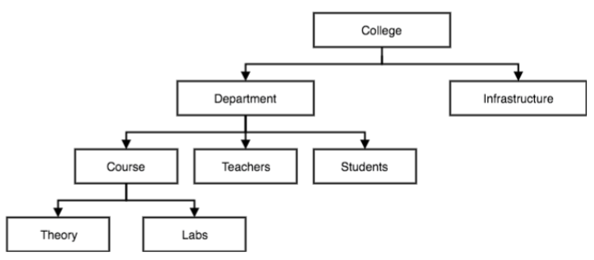
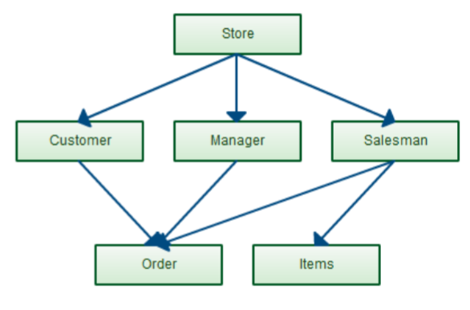
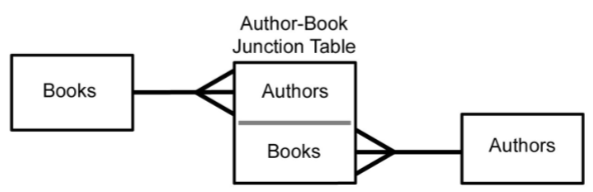
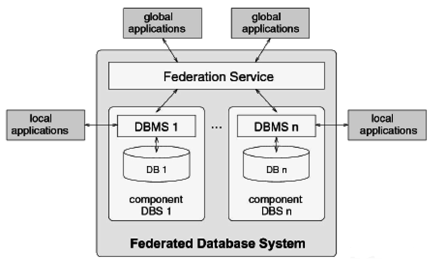

# 1 Overview over different types of DBMSs
- [Categorization based on data models](#categorization-based-on-data-models)
- [Categorization based on architecture](#categorization-based-on-architecture)
- [Categorization based on usage](#categorization-based-on-usage)

## Categorization based on data models

### Hierarchical DBMSs
- 1960s
- First database system developed to keep track of purchase orders for Apollo moon mission
- Adopt a tree like data model: each record having one parent and many children
- DML (Data Manipulation Language) is procedural and record-oriented: procedures have steps (SQL is decorative: describing how the data should look like)
- No query processor (logical and internal data model intertwined)
  - Algorithm is used to find data
- E.g.: IMS (IBM)



### Network DBMSs
- 1970s
- Use a network data model
- More natural modeling of relationships between entities (compared to hierarchical DBMSs)
- Every entity can be linked to each other
- CODASYL DBMSs (Conference on Data Systems Languages)
- DML is procedure and record-oriented
- No query processor (logical and internal data model intertwined), but complex navigation
- E.g.: CA-IDMS (Computer Associates)



### Relational DBMSs
- Late 1970s
- E.F. Codd (IBM Research) saw developers spending their time rewriting IMS and CODASYL programs every time the database's schema or layout changes
- Database abstraction to avoid this maintenance:
  - Store database in simple data structures
  - Access data through high-level language -> SQL
  - Physical storage left up to implementation
- Changed from trees to tables
- Still the most popular model today
- SQL (decorative and set oriented), standard language since 1986
- Query processor
- Strict separation between the logical and internal data model
- E.g.: MySQL, Oracle DBMS, Microsoft SQL

### Object-Oriented DBMSs (OODBMS)
- 1980s 
- Based upon the OO data model
- Avoid "relational-object impedance mismatch" by tightly coupling objects and database
- E.g.: db4o, Caché, GemStone/s, Objectstore
- Only successful in niche markets due to the complexity



### Object-Relational DBMSs (ORDBMS)
- 1990s
- Also referred to as extended relational DBMSs (ERDBMSs)
- Use a relational model extended with OO concepts
- DML is SQL
- Most relational DBMS incorporate object relational extensions

### XML DBMSs
- Use the XML data model to store data
- Native XML DBMSs map the tree structure of an XML document to a physical storage structure
- XML-enabled DBMSs are existing DBMSs that are extended with facilities to store XML data
- Use standardize Query language: XQuery

Example database:

```xml
<?xml version="1.0"?>
<BookStore>
  <Book>
    <Title>My Life and Times</Title>
    <Author>Paul McCartney</Author>
    <Date>1998</Date>
    <ISBN>1-56592-235-2</ISBN>
    <Publisher>McMillin Publishing</Publisher>
  </Book>

  <Book>
    <Title>Illusions - The Adventures of a Reluctant Messiah</Title>
    <Author>Richard Bach</Author>
    <Date>1977</Date>
    <ISBN>0-440-34319-4</ISBN>
    <Publisher>Dell Publishing Co.</Publisher>
  </Book>

  <Book>
    <Title>The First and Last Freedom</Title>
    <Author>J. Krishnamurti</Author>
    <Date>1954</Date>
    <ISBN>0-06-064831-7</ISBN>
    <Publisher>Harper & Row</Publisher>
  </Book>
</BookStore>
```

Example to get Title of Book by Paul McCartney, using XQuery:

```xquery
FOR $b IN document("BookStore.xml")/BookStore/Book
WHERE $b/Author = "Paul McCartney"
RETURN $b/Title
```

### NoSQL DBMSs
- Targeted at storing big and unstructured data
- Can be classified into **key-value stores**, **column-oriented databases**, **document-oriented databases** and **graph-oriented databases**
- Focus on scalability and the ability to cope with irregular or highly volatile data structures
  - Highly volatile: Data that changes a lot; Not optimal for defined schemas, like tables
- E.g.: Apache Cassandra, MongoDB

## Categorization based on architecture

### Centralized architecture
- Data is maintained on a centralized server

### Client server architecture
- Not so different than to centralized architecture
- Active clients request services from passive servers
  - E.g.: DBeaver
- Fat server versus fat client variant

### n-tier architecture
- Client with GUI functionality, application server with applications, database server with DBMS and database, and web server for web-based access

### Cloud DBMS architecture
- DBMS and database are hosted by a third-party cloud provider
- E.g.: Apache Cassandra project and Google's BigTable

### Federated DBMS
- Provides a uniform interface to multiple underlying data sources
- Smart piece of software that receives requests and translates it to get data from databases
- Hides the underlying storage details to facilitate data access



### In-memory DBMS
- Stores all data in internal memory instead of slower external storage (E.g.: disks)
- Often used for real-time purposes (E.g.: Telco or defensive applications)
- Disadvantage: If system shuts down, all data in memory is lost
  - Solution: Periodic snapshots to external storage to support persistence
- E.g.: HANA (SAP), Redic

## Categorization based on usage

### On-line transaction processing (OLTP)
- Focus on managing operational or transactional data
- DB server must be able to process <ins>lots of simple transactions per unit of time</ins>
- DBMS must have good support dor processing a high volume of short, simple queries

### On-line analytical processing (OLAP)
- Focus on using operational data for tactical or strategical decision  making
- Limited number of users formulates <ins>complex queries</ins>
- DBMS should support efficient processing of complex queries which often come in smaller volumes
- Deal with more complicated queries
  - No need to be able to process lots of simple queries at the same time

### Big data & Analytics
- NoSQL database
- Focus on more flexible, or even schema-less, database structures
- Store unstructured information such as E-Mails, text documents, Twitter tweets, Facebook posts, ...

### Multimedia
- Multimedia DBMSs provide storage of multimedia data such as text, images, audio, video, ...
- Should also provide content-based query facilities
- In modern (R)DBMSs multimedia data are usually stored as a binary large object (BLOB)
  - BLOB can be used to store large amounts of bytes

### Spatial applications
- Spatial DBMSs support storage and querying of spatial data (both 2D and 3D)
- Spatial operations such as calculating distances or relationships between objects (E.g.: whether or not one object is contained within another)
- Key building block for Geographical Information Systems (GIS)

### Mobile
- Mobile DBMSs run on smartphones, tablets or other mobile devices
- Should always be online, have a small foot print, and be able to deal with limited processing power, storage and battery life
  - Should have low impact on device

### Open source
- Code of open source DBMSs is publicly available and can be extended by anyone
- E.g.: MySQL, PostgreSQL