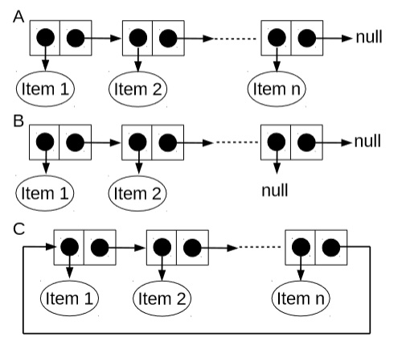

# Table of Contents
1. [Introduction of ALDA](#first)
2. [Arrays and Linked lists](#second)

# 1. ALDA_Introduction <a name="first">

## Algorithm definition
- used in computer science  to describe a problem-solving method suitable for an implementation as a computer program
- method or program to calculate a (mathematical) problem using a certain computational model
- implements a (mathematical) function
- implements operations to transform data via (pre-) defined operations
- examples:
  - operations on basic data structures, e.g. stacks and queues
  - sorting algorithms with an appropriate data structure
  - searching algorithms
  - graph algorithms: shortest path, search in a network, ...

## Typical operations on data
- creation / initialization
- reading / retrieving
- updating (often achieved by deleting and (re-) creation)
- deleting
- searching
- sorting
- union and intersection of sets
- traversal of certain data structures, like trees and graphs

# 2. DataStructures_1 <a name="second">

## Abstract Data Type (ADT)

- defines a type (name) and corresponding methods
- does not define a certain data structure
- fundamental concept of object-oriented programming
- like a java interface, but extended with constructor(s)
- is an API for one type

## Java and ADTs

Hoes does Java support the need for an ADT?
- a Java interface: declares methods to be implemented
  - these methods are public
  - the interface may be package-private
  - there is no constructor defined
- an implementation for all the methods in the interface by a class to be used by a client
- a client program knows the public methods in the interface and can make use of the class that implements the interface
- this is a good approach: to work at a higher level of abstraction, so separate different parts of a complex system
  
Question: why is a constructor never part of an interface?
- because no data members in an interface to initialize
- all data members in interfaces are public static final by default

## Arrays
- a linear sequence of objects of the same type
- size set at initialization and cannot be changed
- items can be accessed through an integer index, ranging from 0 to n-1
- time needed to access an item is independent from the index value
- Notation: elements of an arrays a are:

```java
a[0], a[1], a[2], ..., a[n-3], a[n-2], a[n-1]
```

### Example: Sieve of the Eratosthenes
- algorithm to get prime numbers of a pre-defined number range:

```java
int n = 100;
boolean[] a = new boolean[n];

for (int i = 0; i < n; i++) {
  a[i] = true;
}

for (int i = 0; i < n; i++) {
  if (a[i] != false) {
    for (int j = i; i * j < n; j++) {
      a[i * j] = false;
    }
  }
}
```

## Linked Lists
- most important attributes of a linked list:
  - linear structure: every list node points to the next list node
  - simple operations, like insert and remove
  - head and tail conventions in linked list
- most important basic operations
  - list element insertion
  - list element deletion
- elementary list processing - some important operations
  - list reversal and list traversal
  - list insertion sort (sort while adding)
- circular-list class
- skip lists
- memory allocation for lists (lists can grow, arrays cannot)

### Example of class with linked list data structure

```java
public class LinkedList<E> {

  private static class Node<E> {
    E item;
    Node<E> next;

    Node(E pItem) {
      this.item = pItem;
      next = null;
    }
  }

  private Node<E> list;

  public LinkedList() {
    this.list = new Node<>(null);
  }
}
```

## Data structures: linked list & array

A linked list as a **data structure** and a **general purpose** linked list class are two different things:
- as a **data structure**: a linked list is just one Node class with a next attribute of type Node. No getters or setter or other methods, only a constructor is needed. It's only purpose of existence it to be used in an algorithm. A private static inner class is enough
- a **general purpose** linked list consists of much more code and is complexer. It should function in every possible way, so it is intentionally robust, like the linked list that is provided in the <ins>java.util.LinkedList</ins> package

## Head / Tail / Circular convention
- first node of the list can contain the first item of the list, but can also always be *null*
- if the first node never contains an item, this node is called the **dummy head**. In this case, the first item is stored in the second node
- same with tail: last node can never contain an item, which is the called the **dummy tail**. Here, the last item is stored in the next-to-last node
- if **Circular convention** is used, the last node points to the first, creating a circle

## Options of the final node on linked lists

- A: "normal" linked list, no conventions
- B: tail convention with dummy tail
- C: circular convention

## Java - Linked list deletion
- node reference x points to the node, that has it's next node reference pointing to the node that we want to remove
- to remove the node following node x, we use the statements:

```java
temp = x.next;
x.next = temp.next;
```
- or simply

```java
x.next = x.next.next;
```

## Java - Linked list insertion
- to insert a node t into a list at a position following node x, we use the statements:

```java
t.next = x.next;
x.next = t;
```

## Elementary List Processing
- linked lists as easier re-arrangeable data structures
- instead of avoiding an `IndexOutOfBoundsException` with arrays with linked lists we have to check the references in the list
- basic operations on lists:
  - list traversal
  - add and delete items
  - usage of insertion sort algorithm

## List traversal
- as a contrast to arrays, a method to traverse the list is needed
- if **x** refers to the first node of a list, the final node has a null link 
- **visit** is a method that takes an item as a parameter and checks 

```java
Node t = x;

while(t != null) {
  visit(t.item);
  t = t.next;
}
```

## Head and tail conventions in linked lists
- circular, never empty linked list
- linked list with head reference and dummy tail (most common approach)
- linked list with dummy head and dummy tail
- linked list with dummy head and tail nodes

## Head and tail conventions: circular lists
- first insert:

```java
head.next = head;
```

- insert t after x (t and x are node references, t is a new node):

```java
t.next = x.next;
x.next = t;
```

- remove after x:

```java
x.next = x.next.next;
```

- traversal loop:

```java
t = head;

do {
  ...
  t = t.next;
} 
while (t != head);
```

- test if one item:

```java
head.next == head;
```

## Head and tail conventions: dummy tail
- initialize:

```java
head = null;
```

- insert t after x (t and x are node references, t is a new node):

```java
if (x == null) {
  head = t;
  head.next = null;
} else {
  t.next = x.next;
  x.next = t;
}
```

- remove after x:

```java
t = x.next;
x.next = t.next;
```

- traversal loop:

```java
for (t = head; t != null; t = t.next) {
  ...
}
```

- test if empty:

```java
return head == null;
```

## Head and tail conventions: dummy head and dummy tail
- initialize:

```java
head = new Node();
head.next = null;
```

- insert t after x (t and x are node references, t is a new node):

```java
t.next = x.next;
x.next = t;
```

- remove after x:

```java
t = x.next;
x.next = t.next;
```

- traversal loop:

```java
for (t = head.next; t != null; t = t.next) {
  ...
}
```

- test if empty:

```java
return head.next == null;
```

## Josephus problem
- the josephus problem refers to the problem to select someone to be a leader
- the identity of the elected leader is a function of *N(=9)* and *M(=5)*
- in a range from 1 - 9, one possible outcome can be `5, 1, 7, 4, 3, 6, 9, 2`
- in code:

```java
public class Josephus {
  private static class Node {
    int val;
    Node next;

    Node(int v) {
      this.val = v;
    }
  }

  ...

  public int selectNext(int N, int M) {
    Node head = new Node(1);
    Node current = head;

    for (int i = 2; i <= N; i++) {
      current.next = new Node(i);
      current = current.next;
    }

    current.next = head;

    while (current != current.next) {
      for (int i = 1; i < M; i++) {
        current = current.next;
      }

      current.next = current.next.next;
    }

    return current.val;
  }
}
```

## Possible extension: double linked list
- by adding more links, we can add the capability to move backwards through a linked list
- we can support operations to *"find the item before a given item"* by using a doubly linked list in which we maintain two links for each node:
  - one (`prev`) to the previous item
  - another (`next`) to the next item
- with dummy node or a circular list, we can ensure that `x`, `x.next.prev`, and `x.prev.next` are the same for every node in a doubly linked list
- we then must modify or implement the operations
  - `remove`
  - `insert after`
  - `insert before`
